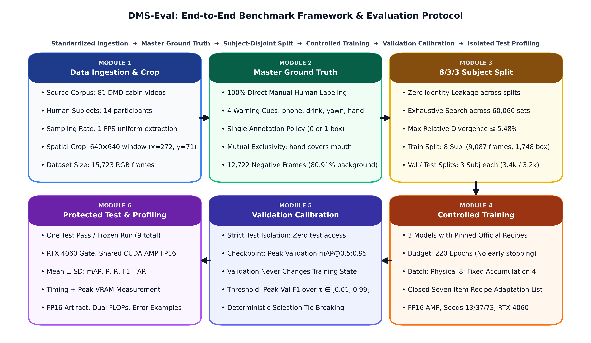
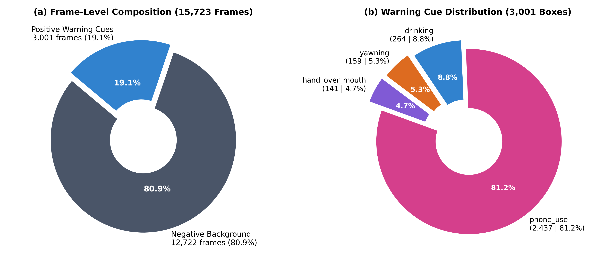
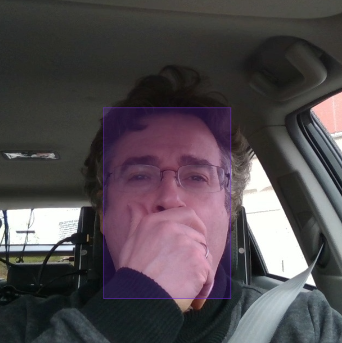
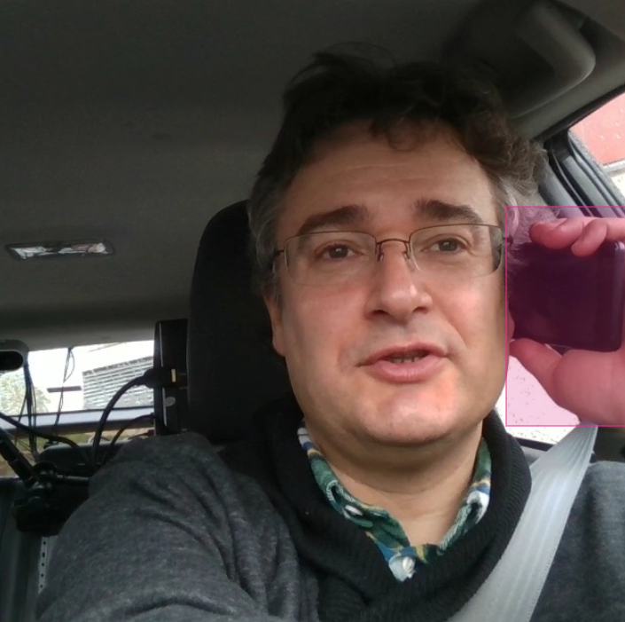

<h1 align="center">DMS-Eval</h1>

<p align="center">
  <strong>A planned benchmark for nano-scale object detectors in frame-level driver monitoring</strong>
</p>

<p align="center">
  
  <a href="LICENSE"></a>
  
  
</p>

<p align="center">
  <a href="https://raw.githubusercontent.com/IamOumarIbrahim/DMS-Eval/main/manuscript/main.pdf" download="DMS-Eval-Manuscript.pdf">
    
  </a>
</p>

<p align="center">
  <strong><a href="https://raw.githubusercontent.com/IamOumarIbrahim/DMS-Eval/main/manuscript/main.pdf" download="DMS-Eval-Manuscript.pdf">Read Full Manuscript (PDF)</a></strong>
</p>

**DMS-Eval** is a planned benchmark framework currently in development for evaluating nano-scale (lightweight) object detection architectures for detecting visual cues associated with driver drowsiness and distraction in real time across diverse cabin operating conditions.

> **Benchmark Mission:** DMS-Eval establishes a standardized evaluation framework comparing real-time nano-scale object detectors (YOLO vs. DETR families) for in-cabin driver state monitoring under single-frame operational constraints.

<a id="controlled-comparison-principle"></a>
> [!IMPORTANT]
> **Controlled-comparison principle**
>
> All models receive the same training/test data, subject-disjoint test split, image resolution, evaluation annotations, metric implementation, hardware, numerical precision, batch size, inference timing protocol, and test-set access policy. Shared training-budget controls—such as maximum epochs, early stopping policy, batch size, gradient accumulation, number of runs, and checkpoint-selection procedure—are kept consistent across models. Architecture-specific optimization settings—such as optimizer, learning rate, scheduler, weight decay, augmentation, and other model-specific recipe choices—follow each architecture’s official training recipe and are documented rather than artificially forced to be identical.

## Benchmark Evaluation Lifecycle

<p align="center">
  <br>
  <sub><b>Figure 1.</b> DMS-Eval end-to-end benchmark framework: from naturalistic DMD video extraction and authoritative Label Studio annotation through deterministic 8/3/3 subject-disjoint partitioning, controlled model training, and validation-calibrated test evaluation.</sub>
</p>

---

## Benchmark at a glance

<div align="center">

<sub><b>Table 1.</b> Frozen benchmark scope summary.</sub>

| Setting | Frozen value | Setting | Frozen value |
| :---: | :---: | :---: | :---: |
| **Dataset** | DMD-derived real-cabin RGB video | **Models** | YOLO11n, D-FINE-N, YOLO26n |
| **Input** | 640×640 individual frames | **Sampling** | 1 frame every 1 second |
| **Split** | 8 / 3 / 3 subjects | **Split unit** | Strictly subject-disjoint |
| **Annotations** | Direct manual human annotation (Label Studio) → master COCO JSON | **Hardware** | NVIDIA RTX 4060, 8 GB VRAM |
| **Training batch** | 1 (accumulate=32, nbs=32) | **Runtime batch** | 1 |
| **Primary metric** | mAP@0.5:0.95 | **Input unit** | Single static frame |

</div>

> [!NOTE]
> **Source DMD Composition & Negative Sample Richness:**
> The original DMD dataset is organized into three behavioral session folders: `distraction`, `drowsiness`, and `gaze`. DMS-Eval incorporates all 81 videos across all three folders. Retaining the `gaze` sessions alongside non-cue driving periods in `distraction` and `drowsiness` supplies a substantial volume of naturalistic negative frames (0 bounding boxes), preventing lightweight object detectors from overtraining on positive cues and training them to suppress false alarms during alert driving. Longer videos naturally contribute proportionally more sampled frames under the uniform 1 FPS policy.

> [!IMPORTANT]
> **Frozen 8/3/3 Subject-Disjoint Split:**
> The 14 participants are partitioned into **8 training**, **3 validation**, and **3 test** subjects with strict subject disjointness ($S_{\text{train}} \cap S_{\text{val}} = \emptyset, S_{\text{train}} \cap S_{\text{test}} = \emptyset, S_{\text{val}} \cap S_{\text{test}} = \emptyset$) using the authoritative exhaustive proportion-matching algorithm ([`scripts/balance_splits.py`](./scripts/balance_splits.py)).
> * **Train (8 subjects, 9,087 frames, 1,748 boxes):** `subject_01`, `subject_04`, `subject_06`, `subject_07`, `subject_08`, `subject_09`, `subject_13`, `subject_14`
> * **Validation (3 subjects, 3,423 frames, 639 boxes):** `subject_02`, `subject_03`, `subject_11`
> * **Test (3 subjects, 3,213 frames, 614 boxes):** `subject_05`, `subject_10`, `subject_12`
>
> Permanently frozen in [`dataset/splits.json`](./dataset/splits.json). All four target cues are represented across all splits with $\le 5.48\%$ relative divergence from the global dataset distribution.

---

## Dataset Preprocessing & Frame Extraction

The implemented frame-extraction and 640×640 cropping pipeline is maintained under [`scripts/`](./scripts/). Extracted images are generated locally under `dataset/images/` and are not intended to be committed to Git.

```text
dataset/images/
├── subject_01/
│   ├── video_01/
│   └── ...
├── subject_02/
│   └── ...
└── ...
```

> [!NOTE]
> The frozen preprocessing rules and the unresolved non-integer-FPS sampling detail are maintained in [Benchmark scope, data & splits](./docs/quick-start.md).

> [!IMPORTANT]
> Annotation uses **Label Studio** (Community Edition) with one project (**DMS-Eval**) and one task per image. Subject, video, filename, and sampled-frame index are retained as task metadata. All 15,723 sampled frames are directly and manually annotated by the human expert annotator under the frozen 4-cue ontology to produce the authoritative master COCO ground truth in `dataset/annotations.json`. See the [annotation protocol](./docs/annotation-protocol.md) and [manual annotation guide (1-page PDF)](./docs/manual-annotation-guide.pdf).

<p align="center">
  <br>
  <sub><b>Figure 2.</b> Benchmark ground-truth distributions: (a) Frame-level dataset composition across all 15,723 frames (80.9% negative background frames vs. 19.1% positive cue frames); (b) Proportion of bounding box annotations across the 4 frozen target warning cues (3,001 total annotations: 81.2% <code>phone_use</code>, 8.8% <code>drinking</code>, 5.3% <code>yawning</code>, 4.7% <code>hand_over_mouth</code>).</sub>
</p>

<p align="center">
  <br>
  <sub><b>Figure 3.</b> Target warning cue distribution across 8/3/3 subject-disjoint partitions: showing balanced proportional alignment ($\le 5.48\%$ relative divergence) across Training, Validation, and Testing splits.</sub>
</p>

---

## Evaluated Model Architectures

<div align="center">

<sub><b>Table 2.</b> Candidate real-time detector architectures evaluated in DMS-Eval.</sub>

| Model Architecture | Architectural Family | Parameter Scale | GFLOPs ($640\times 640$) | Detection Paradigm / Key Feature | Official Source |
| :---: | :---: | :---: | :---: | :---: | :---: |
| **Ultralytics YOLO11n** | Single-Stage CNN | 2.6 M | 6.5 G | C3k2 feature extractors & SPPF modules | [Ultralytics](https://github.com/ultralytics/ultralytics) |
| **Ultralytics YOLO26n** | End-to-End CNN | 2.4 M | 5.8 G | Anchor-free, NMS-free direct bounding box prediction | [Ultralytics](https://github.com/ultralytics/ultralytics) |
| **D-FINE-N** | Real-Time DETR | 3.8 M | 8.4 G | HGNetv2 backbone with Fine-grained Distribution Refinement (FDR) | [D-FINE](https://github.com/Peterande/D-FINE) |

</div>

---

## Documentation

<div align="center">

<sub><b>Table 3.</b> Detailed protocol documentation and execution resources.</sub>

| Document | What it contains | Status covered |
| :---: | :---: | :---: |
| [**Benchmark scope, data & splits**](./docs/quick-start.md) | Frozen scope, preprocessing, subject splits, annotation format, and frame naming | 🧊 Frozen |
| [**Annotation protocol & cue ontology**](./docs/annotation-protocol.md) | Four warning cues, bounding-box rules, removed classes, and data-quality controls | 🧊 Frozen |
| [**Manual annotation field guide (PDF)**](./docs/manual-annotation-guide.pdf) | Single-page desktop PDF reference: hotkey cheat sheet, bounding-box extents, and decision matrix | 📋 Practical field guide |
| [**Training protocol**](./docs/training-protocol.md) | Initialization, model-specific recipes, and shared training controls | 🧊 Frozen |
| [**Evaluation protocol**](./docs/evaluation-protocol.md) | Metrics, evaluator, test isolation, thresholding, checkpoint selection, and runtime profiling | 🧊 Frozen |

</div>

> [!TIP]
> Start with [**Benchmark scope, data & splits**](./docs/quick-start.md), then use the annotation, training, and evaluation documents as the source for authoritative implementation details.

---

## Frozen target cues

<div align="center">

<sub><b>Table 4.</b> Single-frame warning-cue ontology.</sub>

| Drowsiness Cue | Distraction / Inattention Cue |
| :---: | :---: |
| `yawning` | `drinking` |
| `hand_over_mouth` | `phone_use` *(calling)* |

</div>

<p align="center">
  
  
  
  <br>
  <sub><b>Figure 4.</b> Examples of our manual annotations in Label Studio across the 4 frozen target warning cues: <code>yawning</code> (orange box around mouth), <code>hand_over_mouth</code> (purple box), <code>drinking</code> (blue box enclosing hand and beverage container), and <code>phone_use</code> (pink box enclosing phone and hand held at ear in calling posture).</sub>
</p>

> [!NOTE]
> **Ontological Design Decisions:**
> - **Single-Annotation Policy (At Most One Annotation Per Image):** Each sampled frame contains at most one bounding box annotation (0 or 1 annotation per frame). `yawning` and `hand_over_mouth` must **never be labeled twice in one image**; if a driver yawns while a hand covers the mouth, the instance is uniquely labeled as `hand_over_mouth`.
> - **`head_turned_away` & `gaze_away` Removal:** Drivers routinely perform mirror checks (side/rearview mirrors) and visual scanning during safe driving. In isolated 1 FPS static frames without temporal sequence context or 3D gaze tracking, there is no objective or consistent boundary to distinguish brief, safe mirror glances (false positives) from dangerous, prolonged inattention (true positives). To eliminate subjective label noise from split datasets, head rotation is excluded in favor of the 4 self-contained visual warning cues.
> - **`eyes_closed` Removal:** Single-frame 2D object detectors suffer from substantial false positives on momentary physiological blinks and downward road glances; reliable eye-state tracking requires continuous temporal sequence modeling.

> [!TIP]
> Cue definitions, bounding-box extents, exclusions, priority rules, and annotation-quality controls are maintained in the [annotation protocol](./docs/annotation-protocol.md).

---

## Authors & credits

- **Oumar Mamoun Ibrahim** — Senior Undergraduate Researcher, Department of Computer Engineering, University of Sharjah<br>
  [](https://orcid.org/0009-0008-0312-1605)<br>
  [U22200741@sharjah.ac.ae](mailto:U22200741@sharjah.ac.ae)

- **Dr. Mohamad Khairi bin Ishak** — Associate Professor, Department of Computer Engineering, University of Sharjah<br>
  [](https://orcid.org/0000-0002-3554-0061)<br>
  [mishak@sharjah.ac.ae](mailto:mishak@sharjah.ac.ae)

<details>
<summary><strong>Acknowledgments and submission note</strong></summary>

This benchmark builds upon the excellent work of the teams behind [YOLO11](https://docs.ultralytics.com/models/yolo11/), [D-FINE](https://github.com/Peterande/D-FINE), [YOLO26](https://docs.ultralytics.com/models/yolo26/), [Label Studio](https://github.com/HumanSignal/label-studio), and [`label-studio-converter`](https://github.com/HumanSignal/label-studio-converter).

We sincerely thank their authors, contributors, and maintainers for making these architectures, labeling tools, and format converters available to the research community. Their work makes comparative studies such as **DMS-Eval** possible.

> [!NOTE]
> This research and codebase are prepared for submission to the 5th International Conference on Artificial Intelligence Science and Applications in Industry and Society (CAISAIS 2026), held November 25–27, 2026.

</details>

---

## License

This project is licensed under the **Apache License 2.0** — see the [LICENSE](LICENSE) file for details.
