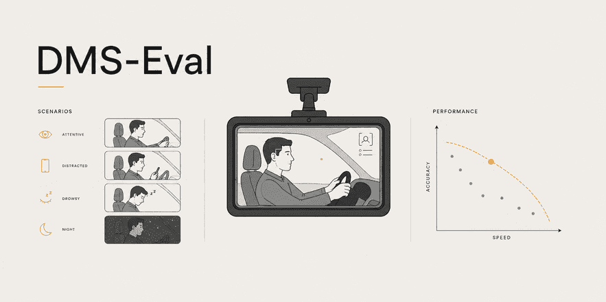

# DMS-Eval


**DMS-Eval** is a benchmark for comparing lightweight object detection architectures for real-time driver drowsiness and distraction monitoring. It evaluates detection performance, inference efficiency, and deployment characteristics under normal, distracted, drowsy, and low-illumination driving conditions.

 [](LICENSE)  

<p align="center">
  
</p>

## Table of Contents

* [Overview](#overview)
  * [Paper Scope](#paper-scope)
* [Evaluation Setup](#evaluation-setup)
* [Evaluated Models](#evaluated-models)
* [Evaluation Metrics](#evaluation-metrics)
* [Evaluation Dataset](#evaluation-dataset)
* [Evaluation Scope](#evaluation-scope)
* [Evaluation Results](#evaluation-results)
* [Future Work](#future-work)
* [Project Structure](#project-structure)
* [Authors & Credits](#authors--credits)
  * [Authors](#authors)
  * [Acknowledgments](#acknowledgments)
* [License](#license)


## Overview

> ### Paper Scope

DMS-Eval benchmarks lightweight object detection architectures for frame-level driver drowsiness and distraction detection under a controlled evaluation protocol.

The study focuses on the trade-off between detection performance, inference latency, and deployment efficiency, with evaluation spanning normal, distracted, drowsy, and low-illumination driving conditions.

> ### Research Question

**RQ**: How do lightweight object detection architectures compare in terms of detection performance, inference efficiency, and deployment footprint for frame-level driver drowsiness and distraction detection under diverse driving conditions?

## Evaluation Setup

> [!TIP]
> All models operate within **2.4–4.0M parameters**, **5.4–7.0 GFLOPs**, and use **640×640 inputs**, keeping the comparison compute-constrained while preserving architectural diversity.

<div align="center">


<sub><strong>Figure 1.</strong> Standardized 640×640 input resolution.</sub>


<table>
  <tr>
    <th align="center">Evaluation Setting</th>
    <th align="center">Configuration</th>
  </tr>
  <tr>
    <td align="center"><strong>Dataset Split</strong></td>
    <td align="center">—</td>
  </tr>
  <tr>
    <td align="center"><strong>Hardware</strong></td>
    <td align="center">—</td>
  </tr>
  <tr>
    <td align="center"><strong>Batch Size</strong></td>
    <td align="center">—</td>
  </tr>
  <tr>
    <td align="center"><strong>Numerical Precision</strong></td>
    <td align="center">—</td>
  </tr>
  <tr>
    <td align="center"><strong>Input Resolution</strong></td>
    <td align="center">640×640</td>
  </tr>
  <tr>
    <td align="center"><strong>Evaluation Protocol</strong></td>
    <td align="center">—</td>
  </tr>
</table>


<sub><strong>Table 1.</strong> Controlled evaluation configuration.</sub>

</div>

## Evaluated Models

<div align="center">

<table>
  <tr>
    <th align="center">Model</th>
    <th align="center">Family</th>
    <th align="center">Architectural Focus</th>
    <th align="center">Post-processing</th>
    <th align="center">Input</th>
    <th align="center">Params (M)</th>
    <th align="center">GFLOPs</th>
    <th align="center">Implementation</th>
    <th align="center">Pretrained Weights</th>
  </tr>

  <tr>
    <td align="center">YOLO11n</td>
    <td align="center">YOLO</td>
    <td align="center">Convolutional baseline (C3k2 / CSP-style)</td>
    <td align="center">NMS-based</td>
    <td align="center">640×640</td>
    <td align="center">2.6</td>
    <td align="center">6.5</td>
    <td align="center">
      <a href="https://docs.ultralytics.com/models/yolo11/"><strong>Ultralytics</strong></a>
    </td>
    <td align="center">COCO</td>
  </tr>

  <tr>
    <td align="center">YOLOv12n (Turbo)</td>
    <td align="center">YOLO</td>
    <td align="center">Area Attention / R-ELAN</td>
    <td align="center">NMS-based</td>
    <td align="center">640×640</td>
    <td align="center">2.5</td>
    <td align="center">6.0</td>
    <td align="center">
      <a href="https://github.com/sunsmarterjie/yolov12"><strong>Official Repo</strong></a>
    </td>
    <td align="center">COCO</td>
  </tr>

  <tr>
    <td align="center">D-FINE-N</td>
    <td align="center">DETR</td>
    <td align="center">Fine-grained distribution refinement</td>
    <td align="center">End-to-end / NMS-free</td>
    <td align="center">640×640</td>
    <td align="center">4.0</td>
    <td align="center">7.0</td>
    <td align="center">
      <a href="https://github.com/Peterande/D-FINE"><strong>Official Repo</strong></a>
    </td>
    <td align="center">COCO</td>
  </tr>

  <tr>
    <td align="center">YOLO26n</td>
    <td align="center">YOLO</td>
    <td align="center">DFL-free native end-to-end inference</td>
    <td align="center">Native NMS-free</td>
    <td align="center">640×640</td>
    <td align="center">2.4</td>
    <td align="center">5.4</td>
    <td align="center">
      <a href="https://docs.ultralytics.com/models/yolo26/"><strong>Ultralytics</strong></a>
    </td>
    <td align="center">COCO</td>
  </tr>
</table>

<p>
  <sub><strong>Table 2.</strong> Architectural and computational characteristics of the evaluated lightweight object detectors.</sub>
</p>

</div>

<div align="center">


<p>
  <sub><strong>Figure 2.</strong> Relative computational footprint of the evaluated lightweight detector variants.</sub>
</p>

</div>

## Evaluation Metrics


The benchmark evaluates each model across both **detection quality** and **deployment efficiency** under a controlled evaluation protocol.

<div align="center">

<table>
  <tr>
    <th>Category</th>
    <th>Metrics</th>
  </tr>
  <tr>
    <td><strong>Detection</strong></td>
    <td>AP, AP<sub>50</sub>, Precision, Recall, F1</td>
  </tr>
  <tr>
    <td><strong>Runtime</strong></td>
    <td>FPS, Latency (ms)</td>
  </tr>
  <tr>
    <td><strong>Complexity</strong></td>
    <td>Params (M), GFLOPs</td>
  </tr>
  <tr>
    <td><strong>Deployment</strong></td>
    <td>Model footprint (MB), Peak Memory (MB)</td>
  </tr>
</table>
<p>
  <sub><strong>AP</strong> denotes AP<sub>50:95</sub>, averaged over IoU thresholds from 0.50 to 0.95.</sub>
</p>
<p>
  <sub><strong>Table 3.</strong> Evaluation metrics used to assess detection quality, runtime performance, model complexity, and deployment characteristics.</sub>
</p>


</div>

> **Primary Detection Metric**

* **AP:** Primary detection metric, averaged across IoU thresholds from 0.50 to 0.95.

> **Threshold-Controlled Metrics**

All models use the same confidence and IoU thresholds.

* **Precision:** Proportion of predicted detections that are correct.
* **Recall:** Proportion of ground-truth objects successfully detected.
* **F1:** Harmonic mean of precision and recall.

> **Runtime Performance**

All models are evaluated using the same hardware, batch size, numerical precision, input resolution, backend, warm-up procedure, and timing methodology.

* **FPS:** Processing throughput of the complete inference pipeline.
* **Latency (ms):** Raw model inference time excluding preprocessing and post-processing.

> **Deployment Characteristics**

* **Params (M):** Total number of model parameters.
* **GFLOPs:** Approximate computational cost per 640×640 input.
* **Model Footprint (MB):** Stored model footprint for deployment.

> **Optional Metrics**

* **AP<sub>50</sub>:** Detection performance at an IoU threshold of 0.50.
* **Peak Inference Memory:** Maximum memory consumption observed during inference.

## Evaluation Dataset

> [!NOTE]
> DMS-Eval targets a curated multi-condition benchmark derived from established driver-monitoring datasets. Dataset access, licensing, and redistribution remain subject to the terms specified by the original dataset providers.

> **Candidate Source Datasets**

* **DMD:** Driver Monitoring Dataset (Vicomtech): [Official Dataset Page](https://dmd.vicomtech.org/)
  * Provides in-cabin recordings spanning distraction- and drowsiness-related behaviors, gaze variation, and hand activity under naturalistic driving conditions.
* **NTHU-DDD:** NTHU Driver Drowsiness Detection Dataset: [Official Dataset Page](http://cv.cs.nthu.edu.tw/php/callforpaper/datasets/DDD/)
  * Provides drowsiness-focused sequences captured under daytime and nighttime illumination conditions, including eye closure, yawning, and sleep-related behaviors.

The final benchmark composition, annotation schema, and train/validation/test protocol will be defined after dataset curation and harmonization.

## Evaluation Scope

> [!IMPORTANT]
> DMS-Eval evaluates lightweight 2D object detection architectures at the **frame level** to provide a controlled comparison of detection performance and deployment efficiency.

The current benchmark focuses on spatially observable driver-monitoring cues associated with drowsiness and distraction. Temporal aggregation of detections across video sequences and temporal driver-state inference are outside the scope of the present study.

## Evaluation Results

<div align="center">

<table>
  <tr>
    <th align="center">Model</th>
    <th align="center">AP ↑</th>
    <th align="center">AP<sub>50</sub> ↑</th>
    <th align="center">Precision ↑</th>
    <th align="center">Recall ↑</th>
    <th align="center">F1 ↑</th>
  </tr>
  <tr>
    <td align="center"><strong>YOLO11n</strong></td>
    <td align="center">—</td>
    <td align="center">—</td>
    <td align="center">—</td>
    <td align="center">—</td>
    <td align="center">—</td>
  </tr>
  <tr>
    <td align="center"><strong>YOLOv12n</strong></td>
    <td align="center">—</td>
    <td align="center">—</td>
    <td align="center">—</td>
    <td align="center">—</td>
    <td align="center">—</td>
  </tr>
  <tr>
    <td align="center"><strong>D-FINE-N</strong></td>
    <td align="center">—</td>
    <td align="center">—</td>
    <td align="center">—</td>
    <td align="center">—</td>
    <td align="center">—</td>
  </tr>
  <tr>
    <td align="center"><strong>YOLO26n</strong></td>
    <td align="center">—</td>
    <td align="center">—</td>
    <td align="center">—</td>
    <td align="center">—</td>
    <td align="center">—</td>
  </tr>
</table>

<p>
  <sub><strong>Table 4.</strong> Detection performance of the evaluated lightweight object detectors.</sub>
</p>

</div>

<div align="center">

<table>
  <tr>
    <th align="center">Model</th>
    <th align="center">Latency (ms) ↓</th>
    <th align="center">FPS ↑</th>
    <th align="center">Params (M) ↓</th>
    <th align="center">GFLOPs ↓</th>
    <th align="center">Model Footprint (MB) ↓</th>
  </tr>
  <tr>
    <td align="center"><strong>YOLO11n</strong></td>
    <td align="center">—</td>
    <td align="center">—</td>
    <td align="center">2.6</td>
    <td align="center">6.5</td>
    <td align="center">—</td>
  </tr>
  <tr>
    <td align="center"><strong>YOLOv12n (Turbo)</strong></td>
    <td align="center">—</td>
    <td align="center">—</td>
    <td align="center">2.5</td>
    <td align="center">6.0</td>
    <td align="center">—</td>
  </tr>
  <tr>
    <td align="center"><strong>D-FINE-N</strong></td>
    <td align="center">—</td>
    <td align="center">—</td>
    <td align="center">4.0</td>
    <td align="center">7.0</td>
    <td align="center">—</td>
  </tr>
  <tr>
    <td align="center"><strong>YOLO26n</strong></td>
    <td align="center">—</td>
    <td align="center">—</td>
    <td align="center">2.4</td>
    <td align="center">5.4</td>
    <td align="center">—</td>
  </tr>
</table>

<p>
  <sub><strong>Table 5.</strong> Runtime performance and deployment characteristics of the evaluated lightweight object detectors.</sub>
</p>

</div>

## Future Work

Future extensions of DMS-Eval may investigate:

* **Temporal driver-state modeling:** Aggregate frame-level detections across video sequences to capture cue persistence, duration, frequency, and temporal evolution.
* **Benchmark expansion:** Extend the dataset with additional subjects, driving environments, camera viewpoints, and challenging low-illumination conditions.
* **Cross-dataset evaluation:** Assess model generalization across independently collected driver-monitoring datasets.
* **Edge deployment:** Evaluate optimized models on resource-constrained embedded hardware using deployment-oriented inference backends and numerical precision settings.

## Project Structure
```text
.
├── assets/
│   ├── 640X640.png                                               // Figure 1
│   ├── Computational Characteristics of Evaluated Models (a).png // Figure 2(a)
│   └── Computational Characteristics of Evaluated Models (b).png // Figure 2(b)
├── core/
├── docs/
├── manuscript/
│   ├── archive/
│   ├── bib/
│   ├── figures/
│   ├── style/
│   └── main.tex          // manuscript LaTeX file
├── .gitignore            // Ignored files
├── CHANGELOG.md          // Version history
├── LICENSE               // Usage license
├── requirements.txt      // software requirements
└── README.md             // Project documentation
```

## Authors & Credits

> ### Authors

* **Dr. Mohamad Khairi bin Ishak** (Associate Professor)  
  Department of Computer Engineering, University of Sharjah  
  📧 [mishak@sharjah.ac.ae](mailto:mishak@sharjah.ac.ae)

* **Oumar Mamoun Ibrahim** (Senior Undergraduate Researcher)  
  Department of Computer Engineering, University of Sharjah  
  📧 [U22200741@sharjah.ac.ae](mailto:U22200741@sharjah.ac.ae)

> ### Acknowledgments

This benchmark builds upon the excellent work of the teams behind [YOLO11](https://docs.ultralytics.com/models/yolo11/), [YOLOv12](https://github.com/sunsmarterjie/yolov12), [D-FINE](https://github.com/Peterande/D-FINE), and [YOLO26](https://docs.ultralytics.com/models/yolo26/).

We sincerely thank their authors, contributors, and maintainers for making these architectures and their implementations available to the research community. Their work makes comparative studies such as **DMS-Eval** possible.

> [!NOTE]
> This research and codebase are prepared for submission to the 5th International Conference on Artificial Intelligence Science and Applications in Industry and Society (CAISAIS 2026).

## License


This project is licensed under the **Apache License 2.0** — see the [LICENSE](LICENSE) file for details.
