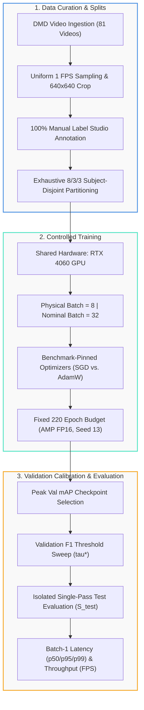

# 📚 DMS-Eval Technical Documentation Hub

[← Back to Main Repository Landing Page](../README.md) · [View Pipeline Scripts](../scripts/README.md) · [Read Manuscript PDF](https://raw.githubusercontent.com/IamOumarIbrahim/DMS-Eval/main/manuscript/main.pdf)

Welcome to the technical documentation hub for **DMS-Eval**, a rigorous empirical benchmark evaluating real-time lightweight 2D object detectors (**Ultralytics YOLO11n**, **Ultralytics YOLO26n**, and **D-FINE-N**) for in-cabin driver drowsiness and distraction warning cue detection under subject-disjoint partitions.

---

## 🗺️ Benchmark Protocol Architecture



---

## 📖 Authoritative Protocol Specifications

<div align="center">

| Protocol Document | Subject Area | Key Specifications | Status |
| :--- | :--- | :--- | :---: |
| [**1. Scope, Data & Splits**](./quick-start.md) | Ingestion & Subject Partitions | 81 DMD videos, 1 FPS uniform rate, $640\times 640$ crop geometry, 15,723 frames, 8/3/3 subject disjointness ($\le 5.48\%$ deviation). | 🧊 Frozen |
| [**2. Annotation & Ontology**](./annotation-protocol.md) | Warning Cues & Ground Truth | 4 visual cues (`phone_use`, `drinking`, `yawning`, `hand_over_mouth`), anatomical boundaries, single-annotation rule ($\le 1$ box/frame), 80.91% negatives. | 🧊 Frozen |
| [**3. Manual Field Guide (PDF)**](./manual-annotation-guide.pdf) | Desktop Quick-Reference | 1-page printable reference: Label Studio keyboard shortcuts, bounding-box extents, and mutual exclusivity decision matrix. | 📋 Field Guide |
| [**4. Training Protocol**](./training-protocol.md) | Training Controls & Optimization | RTX 4060, physical batch 8, nominal effective batch 32, 220 epochs, seed 13, AMP policy, and disclosed backend-specific accumulation/recipes. | 🧊 Frozen |
| [**5. Evaluation Protocol**](./evaluation-protocol.md) | Evaluator Harness & Profiling | COCO $\text{mAP}_{50:95}$, validation grid $\tau \in [0.01,0.99]$, FAR per 100 negative test frames, and model-forward CUDA-event latency. | 🧊 Frozen |
| [**6. Fairness Audit**](./fairness.md) | Threats to Comparability | Directional effects of accumulation, remainder handling, D-FINE stage restart, precision, timing boundary, checkpoint serialization, and single-run uncertainty. | ⚠️ Disclosed |

</div>

---

## 🔒 Foundational Benchmark Tenets

1. **Controlled-Comparison Principle:** All candidates use the same underlying data, 8/3/3 subject-disjoint partition, $640\times640$ resolution, protected annotations, physical batch 8, 220-epoch ceiling, seed 13, RTX 4060 target, shared evaluator, and protected test policy. The nominal effective batch is 32, while accumulation behavior and optimization recipes remain documented backend-specific variables.
2. **100% Manual Expert Ground Truth:** All 15,723 frames extracted from 81 DMD videos are manually labeled in Label Studio by a human expert, incorporating 12,722 true naturalistic negative frames (80.91%) to enforce robust false-alarm suppression.
3. **Strict Validation/Test Isolation:** Checkpoint selection ($\text{mAP}@0.5:0.95$) and confidence threshold calibration ($\tau^*$) are conducted exclusively on the 3 validation subjects ($S_{\text{val}}$) prior to an isolated, single-pass test evaluation on the 3 unseen subjects ($S_{\text{test}}$).

These controls support reproducibility but do not guarantee perfect causal fairness. Review the [fairness audit](./fairness.md) before training or interpreting cross-model results.

---

## 🛠️ Reproduction & Scripts Index

All data extraction, annotation consolidation, partitioning, and training execution scripts are documented in detail in the [**Scripts Suite Documentation**](../scripts/README.md). The master annotations and subject split are already frozen; do not rerun curation stages against the benchmark artifacts during ordinary reproduction.

```bash
# Safe, read-only readiness checks
python scripts/preflight.py
python scripts/validate_backends.py --synthetic
python scripts/validate_dataset.py

# Training launcher dry-run (add --execute-training only when authorized)
python scripts/train_yolo.py --model-id yolo11n
```
