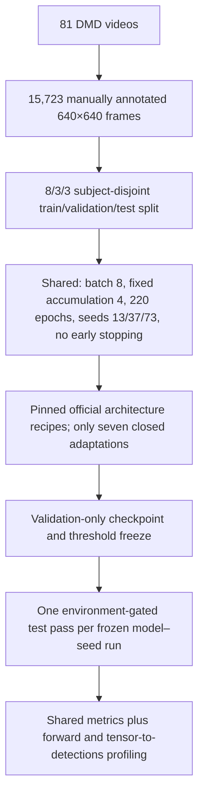

# DMS-Eval Technical Documentation

[Repository landing page](../README.md) · [Scripts](../scripts/README.md) · [Manuscript PDF](../manuscript/main.pdf)

DMS-Eval is a reproducible benchmark of YOLO11n, YOLO26n, and D-FINE-N for four frame-level driver-monitoring warning cues under a protected subject-disjoint protocol.



## Authoritative documents

| Document | Purpose | Status |
|---|---|---|
| [Scope, data, and splits](./quick-start.md) | Dataset construction, counts, and subject isolation | Frozen |
| [Annotation protocol](./annotation-protocol.md) | Four-class ontology and manual ground truth | Frozen |
| [Manual annotation guide](./manual-annotation-guide.pdf) | One-page field guide | Frozen |
| [Training protocol](./training-protocol.md) | Closed adaptation list, shared budget, and pinned official recipes | Frozen |
| [Evaluation protocol](./evaluation-protocol.md) | Shared metrics, protected test, precision, timing, and resources | Frozen |
| [Fairness audit](./fairness.md) | Implemented corrections and residual scope limits | Pre-training audited |
| [Benchmark readiness](./benchmark-readiness.md) | Requirement-to-code traceability and latest verification evidence | Regenerated before training |

## Foundational controls

All candidates use the same underlying data and four classes, 640×640 input, physical batch 8, fixed accumulation 4, 220 epochs, seeds 13/37/73, disabled early stopping, validation-only checkpoint ranking, shared evaluator, RTX 4060 environment gate, common CUDA AMP inference policy, batch-1 timing protocol, and protected test policy. Every training image is retained and the final incomplete accumulation window is sample-correct. All three runs are reported as mean ± sample SD and no best run is selected.

Architecture-specific optimizer, learning-rate, scheduler, weight-decay, and augmentation settings follow pinned official recipes. The complete and closed adaptation list is: DMS-Eval dataset/classes, 640×640 input, batch 8, accumulation 4, 220 epochs, training seeds 13/37/73, and disabled early stopping.

These controls support a system-level comparison. Equal epochs mean equal data exposure, not equal compute; three seeds characterize limited stochastic variation but do not alone establish broad statistical superiority; and native postprocessing remains part of each deployable detector system.

## Safe readiness commands

```powershell
.venv\Scripts\python.exe scripts\benchmark\setup_backends.py
.venv\Scripts\python.exe scripts\benchmark\validate_environment.py
.venv\Scripts\python.exe scripts\benchmark\validate_dataset.py
.venv\Scripts\python.exe scripts\benchmark\validate_backends.py --synthetic
.venv\Scripts\python.exe scripts\benchmark\verify_training_configs.py
.venv\Scripts\python.exe -m pytest -q
```

Training launchers remain dry-runs unless `--execute-training` is explicitly supplied. Protected test access has a separate manifest, environment, execution, and append-only-ledger gate.
