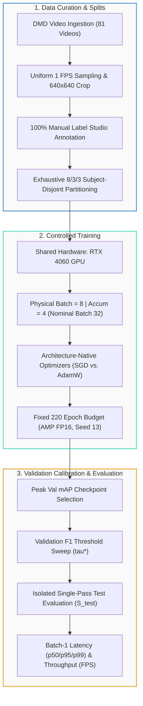

# 📚 DMS-Eval Technical Documentation Hub

[← Back to Main Repository Landing Page](../README.md) · [View Pipeline Scripts](../scripts/README.md) · [Read Manuscript PDF](https://raw.githubusercontent.com/IamOumarIbrahim/DMS-Eval/main/manuscript/main.pdf)

Welcome to the technical documentation hub for **DMS-Eval**, a rigorous empirical benchmark evaluating real-time lightweight 2D object detectors (**Ultralytics YOLO11n**, **Ultralytics YOLO26n**, and **D-FINE-N**) for in-cabin driver drowsiness and distraction warning cue detection under subject-disjoint partitions.

---

## 🗺️ Benchmark Protocol Architecture



---

## 📖 Authoritative Protocol Specifications

<div align="center">

| Protocol Document | Subject Area | Key Specifications | Status |
| :--- | :--- | :--- | :---: |
| [**1. Scope, Data & Splits**](./quick-start.md) | Ingestion & Subject Partitions | 81 DMD videos, 1 FPS uniform rate, $640\times 640$ crop (`272, 71, 640, 640`), 15,723 frames, 8/3/3 subject disjointness ($\le 5.48\%$ deviation). | 🧊 Frozen |
| [**2. Annotation & Ontology**](./annotation-protocol.md) | Warning Cues & Ground Truth | 4 visual cues (`phone_use`, `drinking`, `yawning`, `hand_over_mouth`), anatomical boundaries, single-annotation rule ($\le 1$ box/frame), 80.91% negatives. | 🧊 Frozen |
| [**3. Manual Field Guide (PDF)**](./manual-annotation-guide.pdf) | Desktop Quick-Reference | 1-page printable reference: Label Studio keyboard shortcuts, bounding-box extents, and mutual exclusivity decision matrix. | 📋 Field Guide |
| [**4. Training Protocol**](./training-protocol.md) | Training Controls & Optimization | RTX 4060 GPU, physical batch 8, gradient accumulation 4 (effective batch 32), 220 epochs, seed 13, AMP FP16, native optimizer recipes. | 🧊 Frozen |
| [**5. Evaluation Protocol**](./evaluation-protocol.md) | Evaluator Harness & Profiling | COCO $\text{mAP}_{50:95}$, validation grid sweep $\tau \in [0.01, 0.99]$, background False Alarm Rate (FAR %), batch-1 CUDA-event latency ($p50/p95/p99$). | 🧊 Frozen |

</div>

---

## 🎯 Target Warning Cue Ontology

<div align="center">

| Category ID | Cue Name | Visual Definition | Bounding Box Extent | Mutual Exclusivity Rule |
| :---: | :--- | :--- | :--- | :--- |
| **1** | **`yawning`** | Visible active mouth distension / yawning | Mouth aperture region only | Excluded if mouth is covered by hand |
| **2** | **`hand_over_mouth`** | Hand or fingers visibly covering the mouth region | Full head and face | Overrides `yawning` when covering mouth |
| **3** | **`drinking`** | Driver actively consuming beverage from bottle/can | Interacting hand + bottle together | Passive containers in holders are excluded |
| **4** | **`phone_use`** | Driver holding mobile phone to ear in active call | Hand + device held to ear | Texting / lap-level browsing are excluded |

</div>

---

## 🔒 Foundational Benchmark Tenets

1. **Controlled-Comparison Principle:** All three candidate architectures share identical 8/3/3 subject-disjoint partitions, input dimensions ($640 \times 640$), training budgets (physical batch 8, accumulation 4, 220 epochs, seed 13), evaluation harnesses, and hardware (RTX 4060 GPU), while preserving native optimization recipes (SGD vs. AdamW) to avoid artificial degradation.
2. **100% Manual Expert Ground Truth:** All 15,723 frames extracted from 81 DMD videos are manually labeled in Label Studio by a human expert, incorporating 12,722 true naturalistic negative frames (80.91%) to enforce robust false-alarm suppression.
3. **Strict Validation/Test Isolation:** Checkpoint selection ($\text{mAP}@0.5:0.95$) and confidence threshold calibration ($\tau^*$) are conducted exclusively on the 3 validation subjects ($S_{\text{val}}$) prior to an isolated, single-pass test evaluation on the 3 unseen subjects ($S_{\text{test}}$).

---

## 🛠️ Reproduction & Scripts Index

All data extraction, annotation consolidation, partitioning, and training execution scripts are documented in detail in the [**Scripts Suite Documentation**](../scripts/README.md).

```bash
# Preprocessing & Partitioning
python scripts/extract_and_crop_dmd.py      # Extract & crop 640x640 frames
python scripts/assemble_master_coco.py      # Assemble master COCO JSON
python scripts/balance_splits.py            # Exhaustive 8/3/3 split optimization
python scripts/convert_coco_to_yolo.py      # Convert to YOLO labels
python scripts/prepare_dfine_coco.py        # Prepare D-FINE split JSONs

# Training & Profiling
python scripts/train_yolo.py --model weights/pretrained/yolo11n.pt --batch 8 --accumulate 4 --epochs 220
```
