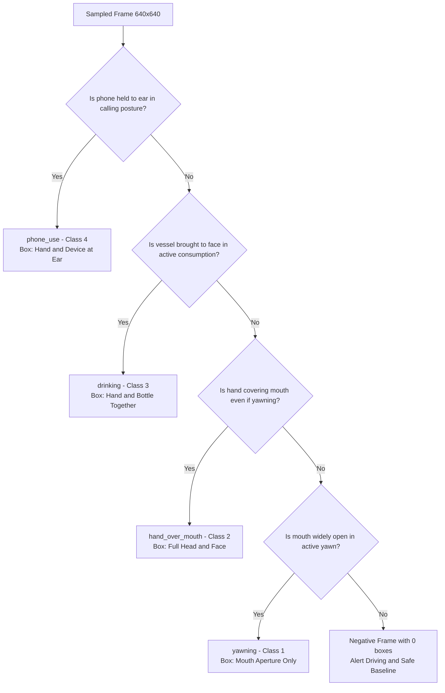

# Annotation Protocol & Cue Ontology

[← Back to Main Landing Page](../README.md) · [Documentation Hub](./README.md) · [Field Guide PDF](./manual-annotation-guide.pdf) · [Training Protocol](./training-protocol.md)

This protocol establishes the visual warning cue ontology, anatomical bounding-box definitions, single-annotation policy, and Label Studio quality controls for the **DMS-Eval** benchmark.

---

## Target Warning Cues

> The DMS-Eval benchmark targets **4 🧊 frozen visual warning cues** with specified bounding-box extents:

<b>Table 1.</b> Frozen target warning cues and bounding-box extents.

| 🧊 Frozen cue | Meaning | Bounding box |
| :--- | :--- | :--- |
| `yawning` | Driver is visibly yawning; an ordinary open mouth is not sufficient | Mouth region only |
| `hand_over_mouth` | Hand visibly covers or occludes the mouth | Full head/face |
| `drinking` | Driver is actively drinking from a bottle, cup, or can with vessel brought to face/mouth | Hand + bottle together |
| `phone_use` | Driver is engaged in an active handheld phone call (holding phone to ear/head); texting/browsing and hands-free calls are excluded | Hand + phone at ear/head |

### Single-Frame Annotation Decision Hierarchy

---

## Annotation Rules

### General

> [!IMPORTANT]
> **Static Frame Context & Single-Annotation Policy (At Most One Annotation Per Image):**
> * All target warning cues are judged using the **individual sampled frame only**. Surrounding video frames are not referenced.
> * **Strict Single-Annotation Constraint:** Each image should have **at most one annotation** (0 or 1 bounding box per image). An image must **never contain multiple annotations**, and `yawning` and `hand_over_mouth` must **never be labeled twice in one image**.
> * **Drowsiness Mutual Exclusivity Priority Rule:** If the driver is yawning while a hand visibly covers or occludes the mouth, annotate strictly as **`hand_over_mouth`** (full head/face). Do not draw a second box for `yawning`. `yawning` is annotated only when the mouth aperture is unobstructed by a covering hand.

### `yawning`

> Annotate only when the sampled frame visibly depicts an active yawn.

* An ordinary open mouth is not automatically considered `yawning`.
* **Bounding Box Extent:** Mouth region only.
* `mouth_open` is **not** an independent class.

   
  <b>Figure 1.</b> An example of our annotation of <code>yawning</code> in Label Studio (enclosing mouth region only).

### `hand_over_mouth`

> Annotate when the driver's hand visibly covers or occludes the mouth.

* **Bounding Box Extent:** Full head/face.

   
  <b>Figure 2.</b> An example of our annotation of <code>hand_over_mouth</code> in Label Studio (enclosing full visible head/face and occluding hand).

### `drinking`

> Annotate when the driver is actively drinking from a bottle, cup, can, or container brought up to the face/mouth.

* **Bounding Box Extent:** Hand + bottle together (enclosing the interacting hand and the beverage container).
* **Exclusions:** Bottles or cups resting passively in cup holders or consoles without active consumption posture.
* Focus is strictly on **active drinking interaction** (hand + bottle).

   
  <b>Figure 3.</b> An example of our annotation of <code>drinking</code> in Label Studio (enclosing interacting hand and beverage container together in active consumption posture).

### `phone_use`

> Annotate when the driver is actively engaged in a handheld phone call (holding the phone to the ear/head).

* **Bounding Box Extent:** Hand + phone held to ear/head (enclosing the interacting hand, phone, and adjacent ear/face region).
* **Scope Definition (Calling Sense Only):** Focus is strictly on **handheld phone calling / holding phone to the ear**.
* **Strict Exclusions:**
  - Texting, lap browsing, or typing on a phone are **excluded**.
  - Hands-free phone calls (Bluetooth/speakerphone) where no device is held to the ear are **excluded**.
  - Phones resting passively on seats, mounts, or consoles are **excluded**.

   
  <b>Figure 4.</b> An example of our annotation of <code>phone_use</code> in Label Studio (enclosing handheld phone and interacting hand held at the ear in calling posture).

---

## Dataset & Cue Distribution

The complete benchmark dataset comprises **15,723 frames** with **3,001 bounding box annotations** across all 14 subjects.

   
  <b>Figure 5.</b> (a) Frame-level dataset composition across 15,723 frames (80.9% negative background frames vs. 19.1% positive cue frames); (b) Proportion of bounding box annotations across the 4 frozen target warning cues (3,001 total boxes).

| Target Category | Domain | Box Count | Percentage Share (%) | Normalized Ratio $(H=1.0)$ |
| :--- | :--- | :---: | :---: | :---: |
| **`phone_use`** | Distraction / Inattention | **2,437** | 81.2% | **17.28** |
| **`drinking`** | Distraction / Inattention | **264** | 8.8% | **1.87** |
| **`yawning`** | Drowsiness | **159** | 5.3% | **1.13** |
| **`hand_over_mouth`** | Drowsiness | **141** | 4.7% | **1.00** |
| **Total Positive Boxes** | — | **3,001** | **100.0%** | — |
| **Negative Frames ($0$ boxes)** | Alert Driving / Gaze | **12,722** | **80.9% of frames** | — |

---

## Annotation Workflow

### 🧊 Frozen Label Studio Organization

* **Annotation tool:** [Label Studio](https://github.com/HumanSignal/label-studio) (Community Edition, local pip installation)
* **Export & format converter:** [`label-studio-converter`](https://github.com/HumanSignal/label-studio-converter) (HumanSignal)
* **Project structure:** One Label Studio project (`DMS-Eval`)
* **Task structure:** One Label Studio task per image (15,723 tasks total)
* **Task metadata:** Subject, video, filename, and sampled-frame index are retained as task metadata to allow filtering and processing by subject.
* Every task uses the same four frozen target-cue rectangle labels.

### Direct Manual Human Annotation

The human expert annotator directly annotates all 15,723 frames to construct the authoritative ground truth for the benchmark.

1. **100% Direct Human Annotation:** The human expert inspects every single sampled frame (including zero-cue frames) and manually draws bounding boxes for all visible cues.
2. **Definitive Ground Truth:** All annotations created and submitted in Label Studio are saved directly into the local database as authoritative human annotations.
3. **No Intermediate Workflow Fields in JSON:** There is no need for intermediate review flags or "human check needed" variables in the dataset schema. Submitted annotations represent finalized ground truth.
4. **Zero-Cue Frames & DMD Source Composition:** Source frames are extracted from all three original DMD behavioral folders (`distraction`, `drowsiness`, and `gaze`). Normal alert driving periods, mirror checks, and entire `gaze` session frames containing none of the 4 cues are submitted with zero bounding boxes. This supplies a large, realistic negative sample distribution essential to prevent models from overtraining on positive cues.
5. **Authoritative Export:** Completed annotations are exported from Label Studio directly into the master COCO file at [`dataset/annotations.json`](../dataset/annotations.json) using the standard COCO exporter specification from [`label-studio-converter`](https://github.com/HumanSignal/label-studio-converter).
6. **Per-Subject Partitions & Training Shuffle:** The master dataset is partitioned into 14 distinct per-subject directories under [`dataset/annotations_per_subject/`](../dataset/annotations_per_subject/) and organized into 8/3/3 split hierarchies under [`dataset/annotations_per_subject_shuffled/`](../dataset/annotations_per_subject_shuffled/) (`Training/`, `Validation/`, `Test/`). A deterministic pseudo-random shuffle (seed 13) is applied exclusively to the 8 training subjects to break adjacent 1 FPS temporal correlations during static single-frame detector training while validation and test sets remain in sequential order.

### Detection Ontology Integrity

Workflow state is not embedded into the detection ontology. The ontology contains **strictly the 4 target visual cues**:
- `yawning`
- `hand_over_mouth`
- `drinking`
- `phone_use`

No synthetic workflow labels (such as `reviewed`, `needs_review`, `ai_generated`, `ambiguous`, or `finalized`) exist in the COCO ground truth classes.

#### External progress ledger

Direct manual human annotation of all 15,723 frames is 100% complete and verified in [`dataset/annotations.json`](../dataset/annotations.json). Workflow states (e.g., `finalized`, `human_reviewed`) were tracked externally and are strictly excluded from the canonical COCO class ontology, ensuring the ground-truth ontology contains strictly the 4 visual warning cue classes.

---

## Behavioral Domains & Target Cue Definitions

> The benchmark categorizes the 4 warning cues across 2 core driver behavioral domains:

<b>Table 2.</b> Behavioral domains and target warning cue definitions.

| Behavioral Domain | Target Warning Cue | Single-Frame Visual Trigger | Bounding Box Extent |
| :---: | :---: | :--- | :--- |
| **Drowsiness** | `yawning` | Visible yawning with wide oral opening and facial elongation | Mouth region only |
| | `hand_over_mouth` | Hand visibly covering or occluding the mouth region | Full head/face |
| **Distraction / Inattention** | `drinking` | Active drinking from a bottle/cup/can brought to the face | Hand + bottle together |
| | `phone_use` | Handheld phone call with phone held to the ear/head | Hand + phone at ear |

---

## Removed Classes & Ontological Scope Decisions

> Deliberately excluded classes and merged concepts to eliminate label ambiguity and subjective annotation noise:

<b>Table 3.</b> Removed, merged, narrowed, and background classes.

| Excluded / Merged Candidate | Category Disposition | Rationale / Benchmark Decision |
| :--- | :--- | :--- |
| `head_turned_away`, `gaze_away` | Removed | **Mirror Checking vs. True Inattention Ambiguity:** Drivers routinely check side and rearview mirrors and perform active visual scanning as safe driving behavior. In single static 1-FPS split frames without continuous temporal video context or 3D gaze tracking, there is no objective or consistent boundary to distinguish brief, safe mirror glances (false positives) from dangerous, prolonged inattention (true positives). Excluded to eliminate subjective label noise in favor of 4 self-contained visual warning cues. |
| `eyes_open`, `drive_safe` | Background / Negative | Normal driving baselines; evaluated as true negatives rather than positive targets |
| `eyes_closed` | Removed | Frame-based 2D object detectors evaluated on single static frames suffer from high false-positive rates due to normal physiological blinks and downward road/mirror glances; reliable eyelid closure tracking requires temporal sequence modeling |
| `head_down` | Removed | Redundant in static single-frame detection and inherently represents a multi-frame temporal event ("falling asleep" / microsleep nodding); excluded from single-frame static warning cue ontology |
| `talk_passenger` | Removed | Substantial visual ambiguity without continuous audio-visual tracking |
| `mouth_open` | Merged | Subsumed directly under `yawning` |
| `eyes_partially_closed` | Removed | Subsumed with `eyes_closed` removal |
| `hand_on_face` | Narrowed | Refined specifically to `hand_over_mouth` |
| `face_occluded` | Quality Flag | Handled as a data-quality / visibility condition rather than an object class |
| `phone_texting` | Removed | Texting / typing on lap is excluded to focus strictly on calling posture (`phone_use`) and beverage interaction (`drinking`) |
| `smoking`, `eating` | Removed | Secondary non-core object interactions outside the benchmark scope |
| `adjust_radio`, `switch_gear` | Removed | Momentary vehicle operation controls |
| `eye_rubbing` | Removed | Highly ambiguous in single static frames without temporal tracking |
| `hands_off_wheel`, `hands_free` | Removed | Explicitly excluded from the current benchmark ontology |

---

## Annotation & Data Quality Controls

### 🧊 Frozen

#### Single-Pass Human Expert Annotation

* **100% Manual Expert Annotation:** All 15,723 sampled frames are directly annotated once by a single manual human expert annotator in Label Studio, ensuring consistent, unified annotation standards across all 14 subjects.
* **Deterministic Single-Frame Rules:** Annotations strictly adhere to the frozen 4-cue ontology, bounding box extents, and decision flowchart. Borderline or ambiguous cases without active visible cues are classified directly as true-negative background frames ($0$ bounding boxes).

#### Partial Occlusion and Truncation

* Partially occluded cues remain annotatable if visibly identifiable.
* Bounding boxes must cover **only the visible portion** of the defined target region.
* **Never estimate, extrapolate, or invent hidden anatomical regions.**
* Targets truncated by the 640×640 boundary are annotated for their **visible area only**.
* Draw bounding boxes as tightly as practical around the visible target.

#### Small Targets

* Small targets remain valid annotations as long as the cue is visually discernable at 640×640.
* No arbitrary minimum pixel cutoff is enforced.

#### Single-Annotation Constraint
 
* **At Most One Annotation Per Image:** Each sampled image must contain at most one bounding box annotation (0 or 1 annotation per frame).
* **Mutual Exclusivity:** `yawning` and `hand_over_mouth` must never be labeled twice in one image. When a covering hand occludes a yawn, prioritize `hand_over_mouth`. No image may contain multiple warning cue bounding boxes.

#### 100% Frame Retention (Zero Frame Removal Policy)

* **No Sampled Frames Removed:** Every single uniformly extracted frame (15,723 frames at 1 FPS across all 81 DMD videos) is permanently retained in the benchmark corpus.
* **Naturalistic Negative Representation:** Real-world cabin artifacts (e.g., lighting transitions, shadows, motion blur, partial face occlusions) are preserved as authentic true-negative background frames ($0$ bounding boxes) rather than being filtered or discarded, ensuring robust false-positive suppression during alert driving.

> [!CAUTION]
> **Data Integrity Controls:**
> * **No Extrapolation:** The annotator must never draw boxes around occluded or out-of-frame anatomy.
> * **Zero Frame Exclusion:** All 15,723 sampled frames are strictly preserved to prevent dataset curation bias.
