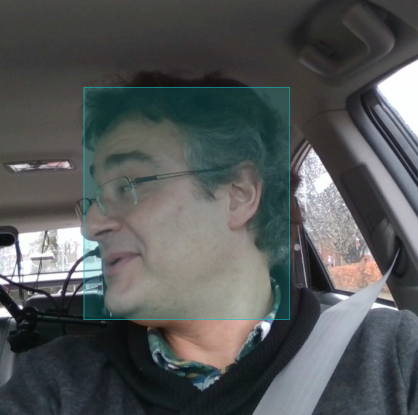

# Annotation Protocol & Cue Ontology

[← Back to the DMS-Eval landing page](../README.md) · [Execution Checklist](./execution-checklist.md)

> [!NOTE]
> This document contains protocol information extracted from the DMS-Eval README. Frozen decisions and unresolved values retain their original status.

> **Jump to:** [Target cues](#target-warning-cues) · [Annotation workflow](#annotation-workflow) · [Cue hierarchy](#cue-categories--visual-salience) · [Detailed rules](#annotation-rules) · [Data quality](#annotation--data-quality)

- [x] Six target warning cues are frozen.
- [x] Bounding-box extents and single-frame rules are frozen.
- [x] Removed and merged classes are documented.
- [x] Annotation-quality controls are frozen.
- [x] Label Studio (Community Edition) is frozen as the annotation tool, using one project (DMS-Eval) and one task per image with metadata filtering.
- [x] Direct manual human expert annotation is established across all 15,723 frames to construct the master ground truth.

---

## Target Warning Cues

> The DMS-Eval benchmark targets **5 🧊 frozen visual warning cues** with specified bounding-box extents:

<p align="center"><sub><b>Table 1.</b> Frozen target warning cues and bounding-box extents.</sub></p>

| 🧊 Frozen cue | Meaning | Bounding box |
| :--- | :--- | :--- |
| `yawning` | Driver is visibly yawning; an ordinary open mouth is not sufficient | Mouth region only |
| `hand_over_mouth` | Hand visibly covers or occludes the mouth | Full head/face |
| `drinking` | Driver is actively drinking from a bottle, cup, or can with vessel brought to face/mouth | Face + bottle together |
| `phone_use` | Driver is engaged in an active handheld phone call (holding phone to ear/head); texting/browsing and hands-free calls are excluded | Hand + phone at ear/head |
| `head_turned_away` | Driver is not focused on the forward roadway (including lateral head rotation left/right and downward cervical flexion / head slump) | Full head/face |

<details>
<summary><strong>Show detailed per-cue annotation rules</strong></summary>

## Annotation Rules

### General

> [!IMPORTANT]
> **Static Frame Context & Co-occurrence:**
> * All target warning cues are judged using the **individual sampled frame only**. Surrounding video frames are not referenced.
> * A frame may contain **multiple target warning cues simultaneously** (e.g., `yawning` alongside `hand_over_mouth` or `head_turned_away`). In such cases, annotate all applicable cues; overlapping bounding boxes are fully permitted.

### `yawning`

> Annotate only when the sampled frame visibly depicts an active yawn.

* An ordinary open mouth is not automatically considered `yawning`.
* **Bounding Box Extent:** Mouth region only.
* `mouth_open` is **not** an independent class.

### `hand_over_mouth`

> Annotate when the driver's hand visibly covers or occludes the mouth.

* **Bounding Box Extent:** Full head/face.

<p align="center">
  <br>
  <sub><b>Figure 1.</b> An example of our annotation of <code>hand_over_mouth</code> in Label Studio (enclosing full visible head/face and occluding hand).</sub>
</p>

### `drinking`

> Annotate when the driver is actively drinking from a bottle, cup, can, or container brought up to the face/mouth.

* **Bounding Box Extent:** Face + bottle together (enclosing the driver's face and the beverage container).
* **Exclusions:** Bottles or cups resting passively in cup holders or consoles without active consumption posture.
* Focus is strictly on **active drinking interaction** (face + bottle).

### `phone_use`

> Annotate when the driver is actively engaged in a handheld phone call (holding the phone to the ear/head).

* **Bounding Box Extent:** Hand + phone held to ear/head (enclosing the interacting hand, phone, and adjacent ear/face region).
* **Scope Definition (Calling Sense Only):** Focus is strictly on **handheld phone calling / holding phone to the ear**.
* **Strict Exclusions:**
  - Texting, lap browsing, or typing on a phone are **excluded**.
  - Hands-free phone calls (Bluetooth/speakerphone) where no device is held to the ear are **excluded**.
  - Phones resting passively on seats, mounts, or consoles are **excluded**.

### `head_turned_away`

> Annotate whenever the driver is not focused on the road forward to them (including lateral head rotation left/right and downward cervical flexion / head slump).

* **Bounding Box Extent:** Full head/face.
* **Merged Cues:** Downward head slump / cervical flexion (`head_down`) is merged directly into this category.

<p align="center">
  <br>
  <sub><b>Figure 2.</b> An example of our annotation of <code>head_turned_away</code> in Label Studio (enclosing full visible head/face).</sub>
</p>

</details>

---

## Annotation Workflow

### 🧊 Frozen Label Studio Organization

* **Annotation tool:** Label Studio (Community Edition, local pip installation)
* **Project structure:** One Label Studio project (`DMS-Eval`)
* **Task structure:** One Label Studio task per image (15,723 tasks total)
* **Task metadata:** Subject, video, filename, and sampled-frame index are retained as task metadata to allow filtering and processing by subject.
* Every task uses the same six frozen target-cue rectangle labels.

### Direct Manual Human Annotation

The human expert annotator directly annotates all 15,723 frames to construct the authoritative ground truth for the benchmark.

1. **100% Direct Human Annotation:** The human expert inspects every single sampled frame (including zero-cue frames) and manually draws bounding boxes for all visible cues.
2. **Definitive Ground Truth:** All annotations created and submitted in Label Studio are saved directly into the local database as authoritative human annotations.
3. **No Intermediate Workflow Fields in JSON:** There is no need for intermediate review flags or "human check needed" variables in the dataset schema. Submitted annotations represent finalized ground truth.
4. **Zero-Cue Frames:** Normal alert driving frames containing none of the 6 cues are submitted with zero bounding boxes and correctly recorded as negative background samples.
5. **Authoritative Export:** Completed annotations are exported from Label Studio directly into the master COCO file at [`dataset/annotations.json`](file:///c:/Dev/repos/Public%20repos/DMS-Eval/dataset/annotations.json).

### Detection Ontology Integrity

Workflow state is not embedded into the detection ontology. The ontology contains **strictly the 5 target visual cues**:
- `yawning`
- `hand_over_mouth`
- `drinking`
- `phone_use`
- `head_turned_away`

No synthetic workflow labels (such as `reviewed`, `needs_review`, `ai_generated`, `ambiguous`, or `finalized`) exist in the COCO ground truth classes.

#### External progress ledger

Maintain a machine-readable annotation progress ledger keyed by the real image filename. It must support safe resume without duplicating annotations or overwriting human-reviewed work, and distinguish at minimum:

```text
not_processed
agent_processed
zero_proposals
secondary_review_required
human_reviewed
finalized
failed
```

This state must not be stored in the COCO class ontology.

---

## Cue Categories & Visual Salience

> **Ontological Hierarchy:** Ranked from the most direct/unambiguous single-frame visual indicator to weaker/more ambiguous postural cues. *(Visual salience does not dictate expected model detection accuracy).*

<p align="center"><sub><b>Table 2.</b> Cue categories and visual-salience hierarchy.</sub></p>

| Behavioral Domain | Target Warning Cue | Salience Rank | Single-Frame Visual Trigger | Bounding Box Extent |
| :--- | :--- | :---: | :--- | :--- |
| **Drowsiness** | `yawning` | 1 *(Highest)* | Visible yawning with wide oral opening and facial elongation | Mouth region only |
| | `hand_over_mouth` | 2 *(Lowest)* | Hand visibly covering or occluding the mouth region | Full head/face |
| **Distraction / Inattention** | `drinking` | 1 *(Highest)* | Active drinking from a bottle/cup/can brought to the face | Face + bottle together |
| | `phone_use` | 2 | Handheld phone call with phone held to the ear/head | Hand + phone at ear |
| | `head_turned_away` | 3 *(Lowest)* | Driver not focused on forward road (head rotated left/right or slumped downward) | Full head/face |

<details>
<summary><strong>Show removed, merged, narrowed, and background classes</strong></summary>

## Removed Classes

> Deliberately excluded classes and merged concepts to eliminate label ambiguity:

<p align="center"><sub><b>Table 3.</b> Removed, merged, narrowed, and background classes.</sub></p>

| Excluded / Merged Candidate | Category Disposition | Rationale / Benchmark Decision |
| :--- | :--- | :--- |
| `eyes_open`, `drive_safe` | Background / Negative | Normal driving baselines; evaluated as true negatives rather than positive targets |
| `eyes_closed` | Removed | Excluded entirely from the single-frame benchmark ontology |
| `head_down` | Merged | Subsumed directly under `head_turned_away` (not focused on the road forward) |
| `talk_passenger` | Removed | Substantial visual ambiguity and overlap with `head_turned_away` |
| `mouth_open` | Merged | Subsumed directly under `yawning` |
| `eyes_partially_closed` | Removed | Subsumed with `eyes_closed` removal |
| `hand_on_face` | Narrowed | Refined specifically to `hand_over_mouth` |
| `face_occluded` | Quality Flag | Handled as a data-quality / visibility condition rather than an object class |
| `phone_texting` | Removed | Texting / typing on lap is excluded to focus strictly on calling posture (`phone_use`) and beverage interaction (`drinking`) |
| `smoking`, `eating` | Removed | Secondary non-core object interactions outside the benchmark scope |
| `adjust_radio`, `switch_gear` | Removed | Momentary vehicle operation controls |
| `gaze_away`, `eye_rubbing` | Removed | Highly ambiguous in single static frames without temporal gaze tracking |
| `hands_off_wheel`, `hands_free` | Removed | Explicitly excluded from the current benchmark ontology |

</details>

---

<details>
<summary><strong>Show annotation and data-quality controls</strong></summary>

## Annotation / Data Quality

### 🧊 Frozen

#### Ambiguous / uncertain cues

* If cue presence is ambiguous, do **not** annotate immediately.
* Flag the uncertain cue for **secondary review**.
* The frame remains in the dataset, but the unverified cue stays **out of the master COCO annotations** until resolved.
* All flagged cues must be settled before model training.

#### Partial occlusion and truncation

* Partially occluded cues remain annotatable if visibly identifiable.
* Bounding boxes must cover **only the visible portion** of the defined target region.
* **Never estimate, extrapolate, or invent hidden anatomical regions.**
* Targets truncated by the 640×640 boundary are annotated for their **visible area only**.
* Draw bounding boxes as tightly as practical around the visible target.

#### Small targets

* Small targets remain valid annotations as long as the cue is visually discernable at 640×640.
* No arbitrary minimum pixel cutoff is enforced.

#### Annotation consistency

* Perform a **second-pass review over the entire dataset** after initial annotation.
* Annotators must keep the class definition sheet accessible during labeling.
* Log unusual cases and edge-rule clarifications in an **annotation decision log** to ensure consistent multi-annotator decisions.

#### Class-choice behavior

* When cue presence is definite but the exact class is borderline, choose the category **immediately** rather than deferring to review.

#### Instance annotation rules

* Each distinct physical instance of a cue receives **one annotation box**.
* If multiple separate instances occur (e.g., both eyes closed), **each instance receives its own box**.

#### Unusable sampled frames

* Genuinely corrupt, blacked-out, or severely motion-blurred frames are **removed from the dataset**.
* Excluded frames must be logged in:

```text
excluded_frames.csv
```

The CSV contains:

```text
filename
exclusion_reason
```

> [!CAUTION]
> **Data Integrity Controls:**
> * **No Extrapolation:** Annotators must never draw boxes around occluded or out-of-frame anatomy.
> * **Strict Logging:** Any excluded frame must be logged with a concrete reason in `excluded_frames.csv` to ensure auditable dataset curation.

</details>
