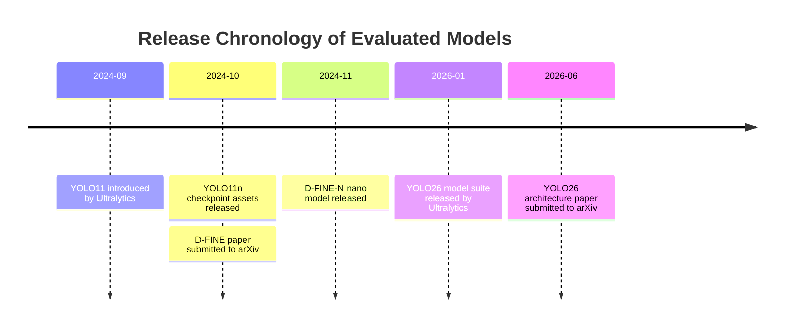

# Evaluated Model Specifications, Checkpoints, and Deployment Analysis

**Project:** DMS-Eval — Controlled Lightweight Object Detection Benchmark for Driver Monitoring Systems  
**Evaluation Scope:** Lightweight 2D Object Detectors ($\le 5.0\text{M}$ Parameters)  
**Standardized Input Resolution:** $640\times640$ RGB  
**Pretrained Initialization Policy:** Official COCO-pretrained weights  
**Hardware Profiling Target:** NVIDIA GeForce RTX 4060 (8 GB VRAM)

---

## 1. Executive Summary

For the frozen DMS-Eval model set—**YOLO11n**, **YOLO26n**, and **D-FINE-N**—official empirical evidence supports a rigorous three-way architectural comparison:
* **YOLO11n:** Mature lightweight convolutional/CSPNet baseline with localized attention (C2PSA) and conventional Non-Maximum Suppression (NMS).
* **YOLO26n:** State-of-the-art edge-oriented convolutional YOLO featuring native end-to-end NMS-free inference and Distribution Focal Loss (DFL) elimination.
* **D-FINE-N:** Structurally distinct Transformer/DETR-family alternative utilizing Fine-grained Distribution Refinement (FDR) and set-prediction loss.

This selection provides a robust empirical contrast across diverse architectural paradigms rather than benchmarking minor variants within a single family.

### Key Architectural & Empirical Insights

1. **COCO Accuracy Baseline:**  
   **D-FINE-N** reports the highest official COCO $\text{AP}_{50:95}$ at **42.8**, versus **40.1** for **YOLO26n** (native end-to-end mode; 40.9 conventional path) and **39.5** for **YOLO11n**. D-FINE-N achieves this at **4.0M parameters / 7.0 GFLOPs**, compared to **2.4M parameters / 5.4 GFLOPs** for YOLO26n and **2.6M parameters / 6.5 GFLOPs** for YOLO11n.
2. **CPU & Edge Efficiency:**  
   **YOLO26n** demonstrates strong compute efficiency for CPU-constrained embedded DMS, reporting **38.9 ms/image** on CPU ONNX ($640\times640$), compared to **56.1 ms/image** for YOLO11n (approx. 25.7 FPS vs. 17.8 FPS).
3. **GPU Reference Throughput:**  
   On NVIDIA T4 TensorRT FP16 ($640\times640$, batch size 1), official figures report **1.5 ms** (YOLO11n, $\approx 667$ FPS), **1.7 ms** (YOLO26n, $\approx 588$ FPS), and **2.12 ms** (D-FINE-N, $\approx 472$ FPS).
4. **Novelty of In-Cabin Evaluation:**  
   None of the three candidate models has first-party quantitative benchmarks on low-light/nighttime driving conditions or in-cabin driver behavioral slices. DMS-Eval’s controlled evaluation provides original empirical data on driver monitoring robustness.
5. **Methodological Control Principle:**  
   Published vendor latencies serve strictly as external reference specifications. All DMS-Eval comparative conclusions are drawn from standardized measurements on the **same NVIDIA RTX 4060 GPU, $640\times640$ resolution, batch size 1, identical precision, warm-up iterations, and CUDA synchronization barriers**.

---

## 2. Architecture & Release Chronology



### Architectural Profiles

* **YOLO11n (Ultralytics, Sep 2024):**
  * **Design:** CNN-dominant one-stage detector with localized self-attention. Features convolutional C3k2 blocks, SPPF spatial pyramid pooling, a C2PSA self-attention block on high-level features, multiscale P3/P4/P5 detection heads, and an anchor-free detection head.
  * **Post-Processing:** Relies on standard Non-Maximum Suppression (NMS).
  * **Canonical Reference:** [Ultralytics YOLO11 Documentation & Model Zoo](https://docs.ultralytics.com/models/yolo11/).
* **D-FINE-N (Peng et al., Oct–Nov 2024):**
  * **Design:** DETR-family CNN/Transformer hybrid. Uses an HGNetv2-B0 convolutional backbone, a HybridEncoder, and a compact Transformer detection decoder. Introduces Fine-grained Distribution Refinement (FDR) and Global Optimal Localization Self-Distillation (GO-LSD).
  * **Post-Processing:** Native end-to-end set prediction (NMS-free).
  * **Canonical Reference:** *D-FINE: Redefine Regression Task in DETRs as Fine-grained Distribution Refinement*, arXiv:2410.13842; [GitHub Repository](https://github.com/Peterande/D-FINE).
* **YOLO26n (Jocher et al., Jan–Jun 2026):**
  * **Design:** CNN-dominant native end-to-end detector. Utilizes C3k2, SPPF, and C2PSA blocks, but eliminates Distribution Focal Loss (DFL) inference overhead. Incorporates Small-Target-Aware Label Assignment (STAL) during training to optimize gradient assignment on tiny objects.
  * **Post-Processing:** Native NMS-free end-to-end inference (`end2end: True`).
  * **Canonical Reference:** *YOLO26: Key Architectural Enhancements and Development*, arXiv:2606.03748; [Ultralytics YOLO26 Documentation](https://docs.ultralytics.com/models/yolo26/).

---

## 3. Comprehensive Model Comparison Matrix

| Attribute | YOLO11n | YOLO26n | D-FINE-N |
| :--- | :--- | :--- | :--- |
| **Model Family** | Ultralytics YOLO (v11) | Ultralytics YOLO (v26) | D-FINE (DETR Family) |
| **Architectural Type** | CNN + Localized Attention (C2PSA) | CNN End-to-End + C2PSA | CNN (HGNetv2) + Transformer Decoder |
| **Post-Processing** | Conventional NMS | Native NMS-Free (End-to-End) | Native NMS-Free (Set Prediction) |
| **Attention Mechanism** | C2PSA on P5 high-level features | C2PSA on high-level features | Transformer Decoder Cross-Attention |
| **Official Paper** | Official Model Documentation / Release | arXiv:2606.03748 (June 2026) | arXiv:2410.13842 (October 2024) |
| **Initial Release Date** | September 29, 2024 (Assets v8.3.0) | January 13, 2026 (Assets v8.4.0) | November 7, 2024 (Nano Release) |
| **Primary Authors / Org** | Ultralytics (Glenn Jocher et al.) | Ultralytics (Glenn Jocher et al.) | Peng et al. (Peking Univ / USTC) |
| **Official Resolution** | $640\times640$ RGB | $640\times640$ RGB | $640\times640$ RGB |
| **Benchmark Resolution** | **$640\times640$ RGB** | **$640\times640$ RGB** | **$640\times640$ RGB** |
| **Parameter Count** | 2.6M | 2.4M (Fused Inference Graph) | 4.0M |
| **Computational Cost** | 6.5 GFLOPs ($640\times640$) | 5.4 GFLOPs ($640\times640$) | 7.0 GFLOPs ($640\times640$) |
| **Checkpoint File Size** | 5.61 MB (5,613,764 bytes on disk) | Measured on disk (`yolo26n.pt`) | Measured on disk (`dfine_n_coco.pth`) |
| **Official COCO $\text{AP}_{50:95}$** | 39.5 | 40.1 (E2E) / 40.9 (Non-E2E) | **42.8** |
| **Official COCO $\text{AP}_{50}$** | Standard COCO Val ($640\times640$) | Standard COCO Val ($640\times640$) | Standard COCO Val ($640\times640$) |
| **CPU Latency (ONNX 640px)** | 56.1 ms ($\approx 17.8$ FPS) | **38.9 ms** ($\approx 25.7$ FPS) | Measured under DMS harness |
| **GPU Latency (T4 FP16)** | 1.50 ms ($\approx 667$ FPS) | 1.70 ms ($\approx 588$ FPS) | 2.12 ms ($\approx 472$ FPS) |
| **Peak GPU VRAM** | Measured via PyTorch CUDA stats | Measured via PyTorch CUDA stats | Measured via PyTorch CUDA stats |
| **Peak Host Memory (RSS)** | Measured via `/usr/bin/time -v` | Measured via `/usr/bin/time -v` | Measured via `/usr/bin/time -v` |
| **Pretrained Baseline** | Official COCO Pretrained | Official COCO Pretrained | Official COCO Pretrained |
| **Small-Object Design** | High-resolution P3/8 feature head | Small-Target-Aware Assignment (STAL) | Fine-Grained Distribution Refine (FDR) |
| **Quantization Readiness** | FP16 & INT8 (TensorRT, OpenVINO, ONNX) | FP16 & INT8 (TensorRT, OpenVINO, ONNX) | FP16 (TensorRT, ONNX documented) |
| **Primary Codebase / Repo** | `ultralytics/ultralytics` | `ultralytics/ultralytics` | `Peterande/D-FINE` |
| **Open-Source License** | AGPL-3.0 / Enterprise | AGPL-3.0 / Enterprise | Apache 2.0 |
| **Official Checkpoint URI** | [`yolo11n.pt`](https://github.com/ultralytics/assets/releases/download/v8.3.0/yolo11n.pt) | [`yolo26n.pt`](https://github.com/ultralytics/assets/releases/download/v8.4.0/yolo26n.pt) | [`dfine_n_coco.pth`](https://github.com/Peterande/storage/releases/download/dfinev1.0/dfine_n_coco.pth) |

---

## 4. Methodological Guidelines & Sanity Checks

### 1. COCO Pretrained Sanity Validation
To ensure identical baseline model weights prior to fine-tuning on the DMS dataset:
```bash
# Validate Ultralytics YOLO models (Batch 1, 640x640)
yolo val model=yolo11n.pt data=coco.yaml imgsz=640 batch=1 device=0
yolo val model=yolo26n.pt data=coco.yaml imgsz=640 batch=1 device=0

# CPU reference runs
yolo val model=yolo11n.pt data=coco.yaml imgsz=640 batch=1 device=cpu
yolo val model=yolo26n.pt data=coco.yaml imgsz=640 batch=1 device=cpu
```

For D-FINE-N, use the official nano configuration file and checkpoint:
* **Configuration:** `configs/dfine/dfine_hgnetv2_n_coco.yml`
* **Checkpoint:** `https://github.com/Peterande/storage/releases/download/dfinev1.0/dfine_n_coco.pth`

### 2. Standardized Checkpoint Disk Footprint Verification
Checkpoint storage must report exact serialized file sizes on disk:
```python
from pathlib import Path

for name in ("yolo11n.pt", "yolo26n.pt", "dfine_n_coco.pth"):
    p = Path(name)
    if p.exists():
        size_bytes = p.stat().st_size
        print(f"{name}: {size_bytes:,} bytes | {size_bytes/1e6:.2f} MB | {size_bytes/(1024**2):.2f} MiB")
    else:
        print(f"{name}: missing")
```

### 3. Standardized GPU Peak Memory & Latency Profiling
```python
import torch

# Reset peak statistics and warm up
torch.cuda.reset_peak_memory_stats()
torch.cuda.synchronize()

# Execute 500 timed forward passes (batch size = 1)
# ... inference loop with per-iteration torch.cuda.synchronize() ...

torch.cuda.synchronize()
peak_allocated_mb = torch.cuda.max_memory_allocated() / 1e6
peak_reserved_mb = torch.cuda.max_memory_reserved() / 1e6
print(f"Peak Allocated: {peak_allocated_mb:.2f} MB | Peak Reserved: {peak_reserved_mb:.2f} MB")
```

---

## 5. Working Hypotheses for DMS Evaluation

1. **Deployment Pareto Hypothesis (YOLO26n):**  
   Due to its low computational complexity (5.4 GFLOPs), native NMS-free architecture, and Small-Target-Aware Label Assignment (STAL), YOLO26n is hypothesized to offer the strongest overall balance between inference latency, CPU throughput, and detection accuracy for embedded DMS deployment.
2. **Accuracy Potential Hypothesis (D-FINE-N):**  
   Leading the candidates in official COCO accuracy (42.8 $\text{AP}_{50:95}$), D-FINE-N is hypothesized to achieve the highest detection quality on fine-grained facial cues (`eyes_closed`, `yawning`), provided transformer query cross-attention scales effectively to in-cabin camera geometries.
3. **Efficiency Baseline Hypothesis (YOLO11n):**  
   YOLO11n provides an essential, mature convolutional baseline with proven TensorRT deployment maturity and an ultra-compact checkpoint footprint (5.61 MB).
4. **Low-Light Robustness (Empirical Open Question):**  
   Because none of the models possesses first-party low-light benchmark data, the condition-wise evaluation across normal daylight and low-light/nighttime slices constitutes an original empirical finding of the DMS-Eval study.

---

## 6. Future Work Architecture Candidates

* **YOLOv12n (Turbo):**
  * **Architectural Innovations:** Area attention mechanisms and Residual Efficient Layer Aggregation Networks (R-ELAN).
  * **Rationale for Deferral:** Deferred to Future Work to permit downstream ONNX/TensorRT export runtimes and custom CUDA attention kernels to mature across edge automotive hardware.