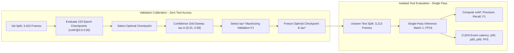

# Evaluation Protocol

[← Back to the DMS-Eval landing page](../README.md)

> [!NOTE]
> This document contains protocol information extracted from the DMS-Eval README. Frozen decisions and unresolved values retain their original status.

> **Jump to:** [Metrics](#frozen-metrics) · [Shared evaluator](#shared-evaluation-harness) · [Test usage](#validation--test-usage) · [Thresholding](#confidence-threshold-selection) · [Runtime](#runtime-profiling)

- [x] Metrics, reporting granularity, shared evaluator, matching rules, and checkpoint selection are frozen.
- [x] Validation/test isolation and one final test pass are frozen.
- [x] Shared runtime hardware, batch size, test coverage, and median-latency reporting are frozen.
- [x] Confidence-threshold candidate generation, selection objective, matching rules, and tie-breaking procedure are frozen.
- [x] Native PyTorch + CUDA, FP16 inference, 10 warm-ups, model-only timing, and CUDA-event latency and throughput procedures are frozen.
- [x] THOP-based local GFLOPs counting and final-checkpoint MB measurement procedures are frozen.
- [ ] Exact CUDA, PyTorch, model-framework versions/commits, NVIDIA GPU-driver, and THOP versions remain unresolved.
- [ ] Handling of unsupported/custom operators in THOP remains unresolved.

---

<a id="frozen-metrics"></a>

### 🧊 Frozen Metrics

> Comprehensive multi-dimensional evaluation matrix:

<p align="center"><sub><b>Table 1.</b> Frozen detection, runtime, and deployment metrics.</sub></p>

| Dimension | Metric | Reporting Granularity | Optimization / Protocol Role |
| :--- | :--- | :--- | :--- |
| **Detection Quality** | `mAP@0.5:0.95` | Full Test Set & Per-Class | Primary benchmark accuracy metric; drives validation checkpoint selection |
| | `mAP@0.5` | Full Test Set & Per-Class | Secondary detection metric and first checkpoint tie-breaker |
| | Precision | Full Test Set | Evaluated at validation-optimal F1 confidence threshold using IoU = 0.50 |
| | Recall | Full Test Set | Evaluated at validation-optimal F1 confidence threshold using IoU = 0.50 |
| | F1-Score | Full Test Set | Primary criterion for per-model validation confidence-threshold selection |
| | False Alarm Rate (FAR %) | Full Test Set (Negative Frames) | Quantifies false alarms on background frames: $\text{FAR} = (\text{FP}_{\text{neg}} / N_{\text{neg}}) \times 100\%$ |
| **Runtime Efficiency** | Latency Percentiles (ms) | Full Test Set | Median ($p50$), 95th ($p95$), and 99th ($p99$) latency; batch size 1; PyTorch CUDA events |
| | Sustained Throughput (FPS) | Full Test Set | Measured continuously across all 3,213 test frames at batch size 1 |
| **Deployment Profile** | Parameters (M) | Architectural | Official published parameter count |
| | Computational Workload (GFLOPs) | Architectural | Calculated with THOP at `1 × 3 × 640 × 640` using `1 MAC = 2 FLOPs` |
| | Peak GPU Memory (MB) | Full Test Set | Measured via `torch.cuda.max_memory_allocated()` at batch size 1 |
| | Model File Size (MB) | Final Selected Checkpoint | Locally measured weight artifact on disk |

> [!NOTE]
> DMS-Eval uses **mAP as the benchmark's detection-accuracy measure**. A separate generic classification `Accuracy` metric is not included.

<details>
<summary><strong>Show reporting structure</strong></summary>

### Reporting Structure

* **Overall test-set reporting:** `mAP@0.5:0.95`, `mAP@0.5`, Precision, Recall, F1-score, Latency ($p50, p95, p99$), sustained FPS, Parameters (M), GFLOPs, Peak VRAM (MB), checkpoint file size (MB), and Background False Alarm Rate (FAR %).
* **Per-class reporting:** `mAP@0.5:0.95` and `mAP@0.5` across all 4 target warning cues.
* Per-class Precision, Recall, and F1-score are not currently included.

<p align="center"><sub><b>Table 2.</b> Benchmark comparative evaluation matrix (NVIDIA RTX 4060, Batch Size 1, FP16).</sub></p>

| Model Architecture | Params (M) | FLOPs (G) | Peak VRAM (MB) | Latency $p50$ (ms) | Latency $p95$ (ms) | Latency $p99$ (ms) | Throughput (FPS) | FAR (%) | mAP@0.5:0.95 | mAP@0.5 | Precision | Recall | F1 Score |
| :--- | :---: | :---: | :---: | :---: | :---: | :---: | :---: | :---: | :---: | :---: | :---: | :---: | :---: |
| **Ultralytics YOLO11n** | 2.6M | 6.5G | `[TO_BE_FILLED]` | `[TO_BE_FILLED]` | `[TO_BE_FILLED]` | `[TO_BE_FILLED]` | `[TO_BE_FILLED]` | `[TO_BE_FILLED]` | `[TO_BE_FILLED]` | `[TO_BE_FILLED]` | `[TO_BE_FILLED]` | `[TO_BE_FILLED]` | `[TO_BE_FILLED]` |
| **Ultralytics YOLO26n** | 2.4M | 5.8G | `[TO_BE_FILLED]` | `[TO_BE_FILLED]` | `[TO_BE_FILLED]` | `[TO_BE_FILLED]` | `[TO_BE_FILLED]` | `[TO_BE_FILLED]` | `[TO_BE_FILLED]` | `[TO_BE_FILLED]` | `[TO_BE_FILLED]` | `[TO_BE_FILLED]` | `[TO_BE_FILLED]` |
| **D-FINE-N** | 3.8M | 8.4G | `[TO_BE_FILLED]` | `[TO_BE_FILLED]` | `[TO_BE_FILLED]` | `[TO_BE_FILLED]` | `[TO_BE_FILLED]` | `[TO_BE_FILLED]` | `[TO_BE_FILLED]` | `[TO_BE_FILLED]` | `[TO_BE_FILLED]` | `[TO_BE_FILLED]` | `[TO_BE_FILLED]` |

</details>

### Shared Evaluation Harness

> Architectural fairness guarantee via a unified ground-truth evaluation pipeline:

All benchmark models are evaluated using **one shared evaluation harness** rather than relying on each model repository's evaluator for the final reported detection metrics.

The evaluation flow is:

```text
master COCO ground truth
        +
model predictions converted to a common COCO-style detection format
        ↓
shared DMS-Eval evaluator
        ↓
reported benchmark metrics
```

* The **master COCO annotations** are used directly as ground truth.
* Each model's predictions are converted into a **common COCO-style detection format** before evaluation.
* The shared evaluator is used for mAP, Precision, Recall, and F1-score.

<details>
<summary><strong>Show precision, recall, and F1 matching rules</strong></summary>

### Precision / Recall / F1 Matching Rules

* Precision, Recall, and F1-score use an **IoU threshold of 0.50**.
* Matching uses a **COCO-style one-to-one rule** within each image and class.
* Predictions are processed in descending confidence order.
* A normal ground-truth instance may be matched to at most one prediction.
* Additional duplicate detections for an already matched ground-truth instance count as false positives.
* The same matching procedure is applied identically to YOLO11n, D-FINE-N, and YOLO26n.

</details>

---

<a id="validation--test-usage"></a>
### Validation / Test Usage

* The **validation split** is used for model selection, checkpoint selection, and confidence-threshold selection.
* The **test split only** is used for final reported benchmark results.
* The test split must remain untouched until all training and model-selection decisions are complete.
* No training decision, checkpoint choice, confidence-threshold choice, or other tuning decision may be based on test-set performance.
* The final test evaluation is performed **once after the protocol and all validation-based model-selection decisions are frozen**.

> [!IMPORTANT]
> **Strict Validation/Test Isolation:**
> Never inspect or compute test-set metrics to guide hyperparameter selection, checkpoint filtering, or threshold sweeps. There is no returning to the test set for additional tuning after the final evaluation pass.

<details>
<summary><strong>Show confidence-threshold selection rule</strong></summary>

### Confidence-Threshold Selection

> Per-model validation-optimal F1 thresholding protocol:

Each model may use its **own confidence threshold**.

For each model:

1. Evaluate candidate confidence thresholds on the **validation split only**.
2. Select the threshold that gives the **highest overall F1-score** using the shared evaluator.
3. If multiple thresholds have the same highest F1-score, select the threshold with the **higher Precision**.
4. If Precision is also tied, select the **higher confidence threshold**.
5. Freeze that model-specific threshold.
6. Apply it unchanged to the test split for final Precision, Recall, and F1-score reporting.

</details>

### Checkpoint Selection

Final checkpoints are selected using validation results from the shared DMS-Eval evaluator in this order:

1. **Highest validation `mAP@0.5:0.95`.**
2. If tied, choose the checkpoint with the **higher validation `mAP@0.5`**.
3. If still tied, choose the checkpoint from the **later epoch**.

### Validation Calibration & Test Isolation Lifecycle



<a id="runtime-profiling"></a>

### Runtime Profiling — 🧊 Frozen

* Final runtime benchmarking uses the **same NVIDIA RTX 4060 with 8 GB VRAM** for all three models.
* The common runtime backend is **native PyTorch + CUDA**.
* Runtime inference precision is **FP16** for YOLO11n, D-FINE-N, and YOLO26n.
* Runtime batch size is **1**.
* Runtime measurements cover the **entire test split**.
* The final test/runtime pass is performed **once**.
* Report **median inference latency** across the measured test images.
* Report both:
  * FPS derived from measured latency.
  * A separately measured throughput/FPS result.

> [!IMPORTANT]
> The primary runtime comparison does not use TensorRT, ONNX Runtime, OpenVINO, or another exported backend.

#### Warm-up Procedure

Before each model's timed runtime measurement, complete **10 untimed warm-up inference passes** under these conditions:

* Batch size: `1`
* Input: 640×640
* Backend: native PyTorch + CUDA
* Inference precision: FP16
* The warm-up passes are excluded from reported latency and throughput measurements.
* The identical procedure is applied to all three models.

#### Latency Timing Boundary

Latency measures **model inference only**.

Inside the latency timer:

* Model forward/inference execution

Outside the latency timer:

* Disk I/O
* Image/file loading
* External dataset preprocessing
* Annotation/evaluator logic
* Benchmark metric computation
* Other non-model work

The timing-boundary definition is identical for all three architectures.

#### Per-Image Latency Timing Method

1. Complete the 10 untimed warm-up passes.
2. Use PyTorch CUDA events around each timed model inference.
3. Synchronize appropriately before reading elapsed GPU time.
4. Record per-image inference latency.
5. Report the already-frozen **median latency** across the entire test split.

Unsynchronized Python wall-clock timing is not used for GPU latency.

#### Separate Throughput/FPS Procedure

1. Complete the 10 untimed warm-up passes.
2. Process the **entire test split continuously**.
3. Keep runtime batch size at `1`.
4. Measure **model inference only**.
5. Place one CUDA start event before the first timed inference.
6. Place one CUDA end event after the final timed inference.
7. Synchronize after the end event.
8. Obtain total elapsed GPU inference time.
9. Compute:

```text
throughput FPS = number of test images / total measured inference time in seconds
```

This result is reported separately from:

```text
latency-derived FPS
```

<details>
<summary><strong>Show deployment-profile protocols and removed condition-wise evaluation</strong></summary>

### Deployment Profile Protocol

* **Parameter counts:** use official published model information rather than independently recounting parameters.

#### Official Published / Reference Values

* Include official published FLOPs information and references for YOLO11n, D-FINE-N, and YOLO26n where available.
* Present official FLOPs information clearly as **official/reference values**.
* Do not use differently produced official FLOPs numbers as the primary directly comparable DMS-Eval measurement.
* Keep official/reference values clearly separate from DMS-Eval locally measured values.
* Official/published model file-size information may also be included as cited reference/context where useful, but it must remain separate from the locally measured benchmark value.

#### DMS-Eval Locally Calculated FLOPs — 🧊 Frozen

The primary directly comparable DMS-Eval computational-workload value is calculated locally with one common procedure:

* **FLOPs-counting tool:** THOP for YOLO11n, D-FINE-N, and YOLO26n.
* Use the **same THOP version** for all three models and record the exact version actually used in the final reproducibility environment.
* **Input tensor shape:** `1 × 3 × 640 × 640`.
* **Batch size:** `1`.
* **Counting scope:** model forward/inference computation only.
* Exclude:
  * Image/file loading
  * Preprocessing
  * NMS or other external post-processing
  * Evaluator logic
  * Metric computation
  * Other non-model operations
* Report the resulting computational workload in **GFLOPs**.
* Convert THOP's MAC count using the frozen convention:

```text
1 MAC = 2 FLOPs
```

Therefore:

```text
GFLOPs = (2 × THOP MACs) / 10^9
```

The exact same tool, input, scope, and conversion convention are applied to all three architectures. Numerical locally calculated GFLOPs values will be populated after measurement; they are future results rather than unresolved protocol decisions.

#### DMS-Eval Locally Measured Model File Size — 🧊 Frozen

* Measure the actual **final validation-selected checkpoint artifact** for each model.
* Apply the **same file-size measurement procedure** to YOLO11n, D-FINE-N, and YOLO26n.
* Report model file size in **MB**.
* The locally measured checkpoint size is the directly comparable DMS-Eval benchmark value.
* Keep any official/published file-size information clearly separate as cited reference/context.
* Do not introduce a MiB column.
* No additional serialization, compression, checkpoint-cleaning, or file-format rule is frozen here.

Exact locally measured checkpoint sizes will be populated after training and validation-based model selection; they are future results rather than unresolved protocol decisions.

### Removed from Current Benchmark

* **Condition-wise evaluation** is removed from the current benchmark because the working dataset does not contain the required low-light/nighttime cabin footage.

</details>

---

<details>
<summary><strong>Show frozen confidence-threshold candidate-generation section</strong></summary>

## Confidence-Threshold Candidate Generation

### 🧊 Frozen

Candidate confidence thresholds are evaluated across a **fixed numerical grid sweep** $\tau \in [0.01, 0.99]$ with a step size of $0.01$ (99 candidate values) on the validation split.

For each of YOLO11n, D-FINE-N, and YOLO26n:

1. Generate predictions on the **validation split only** using the optimal frozen checkpoint.
2. Sweep candidate confidence thresholds $\tau \in [0.01, 0.99]$ in increments of $0.01$.
3. Compute micro-averaged Precision, Recall, and $F_1$-score under COCO one-to-one IoU $\ge 0.50$ matching.
4. Select the threshold $\tau^*$ producing the **highest overall validation $F_1$-score**.

The exact same threshold-search algorithm, $F_1$ objective, matching rules, and tie-breaking procedure are applied uniformly to all three models.

### Confidence-Threshold Tie-Breaking

If multiple candidate thresholds produce the same highest validation $F_1$-score:

1. Select the threshold with the **higher Precision**.
2. If Precision is also tied, select the **higher confidence threshold**.

The selected threshold $\tau^*$ is then permanently frozen for that model and applied unchanged during the final single-pass test evaluation.

> [!NOTE]
> The resulting optimal threshold $\tau^*$ is model-specific ($\tau^*_{\text{YOLO11n}}, \tau^*_{\text{D-FINE-N}}, \tau^*_{\text{YOLO26n}}$) as calibrated on each detector's validation score distribution. Fairness is strictly maintained by applying the **identical numerical grid sweep and selection objective** across all models.

</details>
