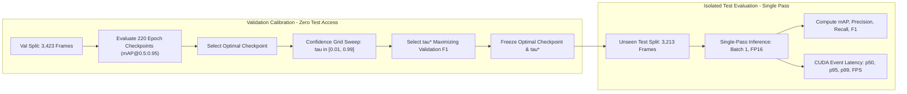

# 📊 Evaluation Protocol & Profiling Harness

[← Back to Main Landing Page](../README.md) · [Documentation Hub](./README.md) · [Training Protocol](./training-protocol.md) · [Pipeline Scripts](../scripts/README.md)

This authoritative protocol governs the detection quality metrics, validation-only confidence threshold calibration ($\tau^*$), checkpoint selection rules, and hardware-synchronized batch-1 latency/throughput profiling for the **DMS-Eval** benchmark.

---

## 🧊 Frozen Evaluation Metrics

<a id="frozen-metrics"></a>

### 🧊 Frozen Metrics

> Comprehensive multi-dimensional evaluation matrix:

<p align="center"><sub><b>Table 1.</b> Frozen detection, runtime, and deployment metrics.</sub></p>

| Dimension | Metric | Reporting Granularity | Optimization / Protocol Role |
| :--- | :--- | :--- | :--- |
| **Detection Quality** | `mAP@0.5:0.95` | Full Test Set & Per-Class | Primary benchmark accuracy metric; drives validation checkpoint selection |
| | `mAP@0.5` | Full Test Set & Per-Class | Secondary detection metric and first checkpoint tie-breaker |
| | Precision | Full Test Set | Evaluated at validation-optimal F1 confidence threshold using IoU = 0.50 |
| | Recall | Full Test Set | Evaluated at validation-optimal F1 confidence threshold using IoU = 0.50 |
| | F1-Score | Full Test Set | Primary criterion for per-model validation confidence-threshold selection |
| | False Alarm Rate (FAR %) | Full Test Set (Negative Frames) | Quantifies false alarms on background frames: FAR = (FP_neg / N_neg) × 100% |
| **Runtime Efficiency** | Latency Percentiles (ms) | Full Test Set | Median (p50), 95th (p95), and 99th (p99) latency; batch size 1; PyTorch CUDA events |
| | Sustained Throughput (FPS) | Full Test Set | Measured continuously across all 3,213 test frames at batch size 1 |
| **Deployment Profile** | Parameters (M) | Architectural | Official published parameter count |
| | Computational Workload (GFLOPs) | Architectural | Calculated with THOP at `1 × 3 × 640 × 640` using `1 MAC = 2 FLOPs` |
| | Peak GPU Memory (MB) | Full Test Set | Measured via `torch.cuda.max_memory_allocated()` at batch size 1 |
| | Model File Size (MB) | Final Selected Checkpoint | Locally measured weight artifact on disk |

> [!NOTE]
> DMS-Eval uses **mAP as the benchmark's detection-accuracy measure**. A separate generic classification `Accuracy` metric is not included.

### Reporting Structure

* **Overall test-set reporting:** `mAP@0.5:0.95`, `mAP@0.5`, Precision, Recall, F1-score, Latency ($p50, p95, p99$), sustained FPS, Parameters (M), GFLOPs, Peak VRAM (MB), checkpoint file size (MB), and Background False Alarm Rate (FAR %).
* **Per-class reporting:** `mAP@0.5:0.95` and `mAP@0.5` across all 4 target warning cues.

<p align="center"><sub><b>Table 2.</b> Benchmark comparative evaluation matrix framework (NVIDIA RTX 4060, Batch Size 1, FP16).</sub></p>

| Model Architecture | Params (M) | FLOPs (G) | Peak VRAM (MB) | Latency p50 (ms) | Latency p95 (ms) | Latency p99 (ms) | Throughput (FPS) | FAR (%) | mAP@0.5:0.95 | mAP@0.5 | Precision | Recall | F1 Score |
| :--- | :---: | :---: | :---: | :---: | :---: | :---: | :---: | :---: | :---: | :---: | :---: | :---: | :---: |
| **Ultralytics YOLO11n** | 2.6M | 6.5G | `[PENDING]` | `[PENDING]` | `[PENDING]` | `[PENDING]` | `[PENDING]` | `[PENDING]` | `[PENDING]` | `[PENDING]` | `[PENDING]` | `[PENDING]` | `[PENDING]` |
| **Ultralytics YOLO26n** | 2.4M | 5.8G | `[PENDING]` | `[PENDING]` | `[PENDING]` | `[PENDING]` | `[PENDING]` | `[PENDING]` | `[PENDING]` | `[PENDING]` | `[PENDING]` | `[PENDING]` | `[PENDING]` |
| **D-FINE-N** | 3.8M | 8.4G | `[PENDING]` | `[PENDING]` | `[PENDING]` | `[PENDING]` | `[PENDING]` | `[PENDING]` | `[PENDING]` | `[PENDING]` | `[PENDING]` | `[PENDING]` | `[PENDING]` |

---

### Shared Evaluation Harness

> Architectural fairness guarantee via a unified ground-truth evaluation pipeline:

All benchmark models are evaluated using **one shared evaluation harness** rather than relying on each model repository's evaluator for the final reported detection metrics.

```text
master COCO ground truth
        +
model predictions converted to a common COCO-style detection format
        ↓
shared DMS-Eval evaluator
        ↓
reported benchmark metrics
```

* The **master COCO annotations** (`dataset/annotations.json`) are used directly as ground truth.
* Each model's predictions are converted into a **common COCO-style detection format** before evaluation.
* The shared evaluator computes mAP, Precision, Recall, F1-score, and FAR %.
* Precision, Recall, and F1-score use an **IoU threshold of 0.50** with **COCO-style one-to-one greedy matching** in descending confidence order.

---

### Validation / Test Isolation Protocol

* The **validation split ($S_{\text{val}}$)** is used strictly for checkpoint selection and confidence-threshold calibration ($\tau^*$).
* The **test split ($S_{\text{test}}$)** is used strictly for final reported benchmark results in a single frozen pass.
* No training decision, checkpoint choice, confidence-threshold choice, or other tuning decision may be based on test-set performance.

> [!CAUTION]
> **Strict Validation/Test Isolation:**
> Never inspect or compute test-set metrics to guide hyperparameter selection, checkpoint filtering, or threshold sweeps. There is no returning to the test set for additional tuning after the final evaluation pass.

---

### Checkpoint Selection Protocol

Final checkpoints are selected using validation results from the shared DMS-Eval evaluator in this order:
1. **Primary:** Highest validation $\text{mAP}@0.5:0.95$.
2. **First Tie-Breaker:** Highest validation $\text{mAP}@0.5$.
3. **Second Tie-Breaker:** Later epoch checkpoint.

---

### Validation-Only Confidence Threshold Calibration ($\tau^*$)

Candidate confidence thresholds are evaluated across a **fixed numerical grid sweep** $\tau \in [0.01, 0.99]$ with a step size of $0.01$ (99 candidate values) on the validation split:

$$\tau^* = \arg\max_{\tau \in [0.01, 0.99]} F_1(\tau; S_{\text{val}}) = \frac{2 \cdot P(\tau) \cdot R(\tau)}{P(\tau) + R(\tau)}$$

**Deterministic Tie-Breaking Logic:**
1. If multiple candidate thresholds produce the same highest validation $F_1$-score, select the threshold with the **higher Precision**.
2. If Precision is also tied, select the **higher confidence threshold**.

Once calibrated, $\tau^*$ is permanently frozen for that model and applied unchanged during the single-pass test evaluation.



---

### Runtime Latency & Throughput Profiling

* **Hardware:** Dedicated NVIDIA RTX 4060 GPU (8 GB VRAM).
* **Backend:** Native PyTorch + CUDA in FP16 precision.
* **Batch Size:** `1` (single-frame streaming edge inference).
* **Warm-up Protocol:** 10 untimed forward passes before starting timers.
* **Timing Scope:** Forward inference pass only (excludes disk I/O, image decode, pre-processing, post-processing/NMS, & metrics).
* **Timing Mechanism:** Hardware-synchronized `torch.cuda.Event` timers.
* **Reporting:** Median ($p50$), 95th ($p95$), and 99th ($p99$) latency (ms), and sustained continuous throughput (FPS = $3,213 / T_{\text{total}}$).

---

### Deployment Footprint & Computational Workload

* **Computational Workload (GFLOPs):** Calculated locally using THOP at tensor shape $1 \times 3 \times 640 \times 640$ with the standard convention $1 \text{ MAC} = 2 \text{ FLOPs}$ ($\text{GFLOPs} = 2 \times \text{MACs} / 10^9$).
* **Peak GPU VRAM:** Measured directly via `torch.cuda.max_memory_allocated()` during test inference.
* **Model Checkpoint Size:** Measured directly from the saved `.pt` artifact file on disk (MB).
