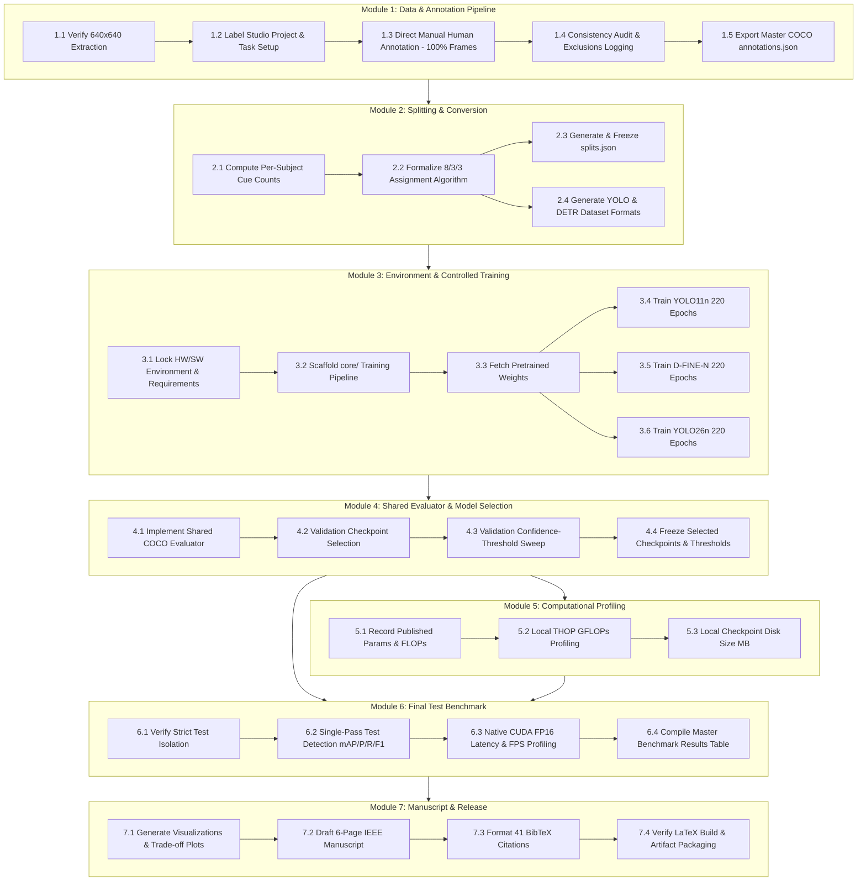

# DMS-Eval: Step-by-Step Execution Checklist & Module Roadmap

[← Back to the DMS-Eval landing page](../README.md) · [Quick Start & Scope](./quick-start.md) · [Annotation Protocol](./annotation-protocol.md) · [Training Protocol](./training-protocol.md) · [Evaluation Protocol](./evaluation-protocol.md)

---

## 📌 Document Overview & Purpose

This document provides a **comprehensive, step-by-step execution checklist** for the **DMS-Eval** benchmark framework from this current development milestone through to final experimental evaluation, manuscript preparation, and conference submission (IEEE CAISAIS 2026).

The checklist is structured into **7 core operational modules**, each formatted as a detailed execution table detailing task objectives, operational protocols, inputs/outputs, dependencies, quality controls, and protocol status (**🧊 Frozen**, **⚠️ Resolve Later**, **🔄 In Progress**, or **⏳ Pending**).



---

## 🚦 Protocol Status & Resolve-Later Tracking Ledger

All open items previously marked **⚠️ Resolve Later** are mapped directly to their explicit resolution steps in the checklist:

| Unresolved Item | Protocol Impact | Checklist Resolution Step | Target Milestone / Artifact |
| :--- | :--- | :--- | :--- |
| **Exact Train / Val / Test Subject IDs** | 🔴 Core Split Fairness | [Step M2.3](#module-2-subject-disjoint-dataset-partitioning--format-conversion) | Permanent freeze in [`dataset/splits.json`](file:///c:/Dev/repos/Public%20repos/DMS-Eval/dataset/splits.json) |
| **8/3/3 Subject Assignment Algorithm** | 🟠 Split Reproducibility | [Step M2.2](#module-2-subject-disjoint-dataset-partitioning--format-conversion) | Multi-objective optimization script in `scripts/` |
| **Software Stack & Library Versions / Commits** | 🟠 Runtime Reproducibility | [Step M3.1](#module-3-environment-locking-core-scaffolding--controlled-training) | Pinned `requirements.txt` & environment manifest |
| **Validation Confidence Thresholds ($\tau$)** | 🟢 Precision/Recall Evaluation | [Step M4.3](#module-4-shared-evaluation-harness--validation-model-selection) | Frozen threshold array $(\tau_{\text{YOLO11n}}, \tau_{\text{D-FINE-N}}, \tau_{\text{YOLO26n}})$ |
| **Unsupported Operators in THOP Profiling** | 🟠 Workload Comparability | [Step M5.2](#module-5-computational--deployment-footprint-profiling) | Unified custom THOP operator rule / handler |
| **Non-Integer FPS Sampling Rule (~29.76 FPS)** | 🟢 Preprocessing Documentation | [Step M1.1](#module-1-dataset-curation-label-studio-annotation-workflow--ground-truth) | Exact timestamp vs. index mapping documented in manifest |

---

## Module 1: Dataset Curation, Label Studio Annotation Workflow & Ground Truth

> **Mission:** Transform raw extracted 640×640 single-frame driver cabin crops into human-annotated, authoritative master ground truth stored in [`dataset/annotations.json`](file:///c:/Dev/repos/Public%20repos/DMS-Eval/dataset/annotations.json).

| Step ID | Task / Operation | Detailed Execution Instructions | Input / Dependencies | Output / Artifacts | Status | Quality Control & Verification Criteria |
| :--- | :--- | :--- | :--- | :--- | :---: | :--- |
| **M1.1** | **Extraction & Crop Audit** | Re-run or audit `scripts/extract_and_crop_dmd.py` with `--verify-only`. Confirm all 81 videos across 14 subjects are extracted at 1 FPS and cropped to frozen coordinates (`x=272, y=71, w=640, h=640`). Document exact frame-index mapping. | Source DMD videos; [`scripts/extract_and_crop_dmd.py`](file:///c:/Dev/repos/Public%20repos/DMS-Eval/scripts/extract_and_crop_dmd.py) | Verified frames in `dataset/images/`; [`dataset/manifest.json`](file:///c:/Dev/repos/Public%20repos/DMS-Eval/dataset/manifest.json) | 🧊 Frozen | Zero black frames (`max_pixel > 0`), zero corrupted headers; Laplacian sharpness logged. Frame names conform to `subject_<ID>_video_<ID>_frame_<NUM:04d>.jpg`. |
| **M1.2** | **Label Studio Setup & Task Initialization** | Initialize one Label Studio Project ("DMS-Eval"). Create 15,723 tasks with metadata (subject, video, sampled frame index). Configure the 6 frozen target classes. | Cropped frames in `dataset/images/` | One Label Studio Project with frozen label schema | 🧊 Frozen | Label schema shares identical 6-class labels: `eyes_closed`, `yawning`, `head_down`, `hand_over_mouth`, `drinking`, `head_turned_away`. |
| **M1.3** | **Direct Manual Human Annotation (100% Frames)** | Human expert manually inspects and annotates every single sampled frame (including zero-cue frames) in Label Studio. Enforce bounding box extents: `eyes_closed` (separate per eye), `yawning` (mouth only), `head_down` (full head), `hand_over_mouth` (full head), `drinking` (face+bottle), `head_turned_away` (full head). | Label Studio UI; [`docs/annotation-protocol.md`](file:///c:/Dev/repos/Public%20repos/DMS-Eval/docs/annotation-protocol.md); [`docs/manual-annotation-guide.pdf`](file:///c:/Dev/repos/Public%20repos/DMS-Eval/docs/manual-annotation-guide.pdf) | Authoritative annotations in Label Studio | 🔄 In Progress | 100% of frames inspected. No extrapolation of hidden anatomy. Overlapping boxes allowed for co-occurring cues. |
| **M1.4** | **Consistency Audit & Exclusions Logging** | Conduct a second-pass review across the entire dataset to ensure inter-subject labeling consistency. Identify and log genuinely unusable/corrupted frames into `dataset/excluded_frames.csv` (`filename, exclusion_reason`). | Completed Label Studio tasks | Audited annotations; [`dataset/excluded_frames.csv`](file:///c:/Dev/repos/Public%20repos/DMS-Eval/dataset/excluded_frames.csv) | ⏳ Pending | Second-pass audit completes across all 14 subjects. All excluded frames documented with concrete rationale. |
| **M1.5** | **Export & Assemble Master COCO JSON** | Export finalized annotations from Label Studio. Merge and format into single authoritative COCO format ground truth saved at `dataset/annotations.json`. Verify image paths, IDs, categories (1–6), and bounding box coordinates $[x, y, w, h]$. | Label Studio Export | [`dataset/annotations.json`](file:///c:/Dev/repos/Public%20repos/DMS-Eval/dataset/annotations.json) | ⏳ Pending | Valid COCO JSON schema. Bounding boxes strictly within $640 \times 640$ image dimensions. Exactly 6 category definitions. |

---

## Module 2: Subject-Disjoint Dataset Partitioning & Format Conversion

> **Mission:** Statistically partition the 14 subjects into 8 Train / 3 Validation / 3 Test subjects with balanced cue distributions, freeze [`dataset/splits.json`](file:///c:/Dev/repos/Public%20repos/DMS-Eval/dataset/splits.json), and generate model-ready format subsets.

| Step ID | Task / Operation | Detailed Execution Instructions | Input / Dependencies | Output / Artifacts | Status | Quality Control & Verification Criteria |
| :--- | :--- | :--- | :--- | :--- | :---: | :--- |
| **M2.1** | **Extract Per-Subject Cue Counts** | Parse master `annotations.json` to compute exact frame-level occurrence frequencies for each of the 6 target warning cues per subject ($S_1, \dots, S_{14}$). If a frame contains multiple cues, count once toward each active cue. | [`dataset/annotations.json`](file:///c:/Dev/repos/Public%20repos/DMS-Eval/dataset/annotations.json) | Per-subject cue distribution matrix (CSV / JSON) | 🧊 Frozen | Frame counts tabulated (not raw box counts). All 14 subjects profiled. |
| **M2.2** | **Formalize 8/3/3 Subject Assignment Method** | Implement a deterministic combinatorial optimization / search algorithm (e.g., exhaustive evaluation of all $\binom{14}{8} \times \binom{6}{3} = 3003 \times 20 = 60,060$ valid 8/3/3 subject partitions) that minimizes cue distribution divergence (e.g., normalized Kullback-Leibler divergence or Chi-squared distance) relative to the ~57.1% / 21.4% / 21.4% split ratio. | Per-subject cue matrix; `scripts/balance_splits.py` | Partition scoring logs & optimal subject candidate set | ⚠️ Resolve Later | Algorithm guarantees all 6 target cues are present in Train, Val, and Test splits. Deterministic, fully reproducible selection. |
| **M2.3** | **Freeze & Validate `splits.json`** | Write optimal subject assignment into `dataset/splits.json` under `"train"`, `"validation"`, and `"test"`. Permanently freeze this file. | Selected subject IDs | [`dataset/splits.json`](file:///c:/Dev/repos/Public%20repos/DMS-Eval/dataset/splits.json) | ⚠️ Resolve Later | Strict disjointness: $\text{Train} \cap \text{Val} = \emptyset$, $\text{Train} \cap \text{Test} = \emptyset$, $\text{Val} \cap \text{Test} = \emptyset$. Total subjects = 8 + 3 + 3 = 14. |
| **M2.4** | **Build YOLO Format Converter** | Implement converter `scripts/convert_coco_to_yolo.py` deriving normalized YOLO `.txt` labels (`class_id x_center y_center width height`) from `annotations.json` and `splits.json`. Generate `dataset/yolo/` directory structure and `dms_eval.yaml` pointing to train/val/test splits. | `annotations.json`, `splits.json` | `dataset/yolo/labels/`, `dataset/yolo/images/`, `dataset/yolo/dms_eval.yaml` | 🧊 Frozen | Class index mapping strictly 0-indexed ($0\dots5$). Bounding box normalized coordinates within $[0.0, 1.0]$. Zero background leakage. |
| **M2.5** | **Build DETR / D-FINE Format Converter** | Implement converter `scripts/split_coco_annotations.py` partitioning master `annotations.json` into three standalone COCO JSON files: `dataset/coco/instances_train.json`, `instances_val.json`, and `instances_test.json` based on `splits.json`. | `annotations.json`, `splits.json` | `dataset/coco/instances_train.json`, `instances_val.json`, `instances_test.json` | 🧊 Frozen | Category IDs consistent with master schema. Image IDs and annotation IDs globally unique and preserved. |
| **M2.6** | **Dataset Split Sanity Check & Verification** | Run verification script checking image counts, bounding box totals, cue representation, and zero subject overlap across YOLO and COCO split directories. | Converted dataset directories | Split verification report | 🧊 Frozen | Split parity verified: YOLO and COCO representations contain identical images, bboxes, and labels for all splits. |

---

## Module 3: Environment Locking, `core/` Scaffolding & Controlled Training

> **Mission:** Lock software dependencies, scaffold the benchmark codebase under [`core/`](file:///c:/Dev/repos/Public%20repos/DMS-Eval/core/), and execute full-model fine-tuning for **YOLO11n**, **D-FINE-N**, and **YOLO26n** under frozen shared training controls.

| Step ID | Task / Operation | Detailed Execution Instructions | Input / Dependencies | Output / Artifacts | Status | Quality Control & Verification Criteria |
| :--- | :--- | :--- | :--- | :--- | :---: | :--- |
| **M3.1** | **Software Environment Pinning** | Record exact CUDA version, NVIDIA driver version, PyTorch version, cuDNN version, Ultralytics commit/version, D-FINE repository commit, and THOP version on the target RTX 4060 system. Pin all dependencies into `requirements.txt`. | Hardware host; Python venv | Pinned `requirements.txt`; Environment specification log | ⚠️ Resolve Later | Complete environment manifest recorded for exact paper reporting and bitwise reproducibility. |
| **M3.2** | **Scaffold `core/` Codebase Architecture** | Implement modular framework under `core/`: `core/datasets/` (data loaders), `core/models/` (model wrappers for YOLO11n, D-FINE-N, YOLO26n), `core/trainers/` (training runners enforcing shared controls), `core/evaluator/` (shared evaluation harness), and `core/profiler/` (latency & FLOPs tools). | Codebase architecture design | Modular Python package under `core/` | 🧊 Frozen | Clean separation of concerns; zero hardcoded paths; supports single-command reproducible runs. |
| **M3.3** | **Fetch Pretrained Checkpoints** | Download official pretrained weights for candidate models: `yolo11n.pt`, `dfine_n.pth` (HGNetv2 backbone), and `yolo26n.pt`. Verify checksums and record source URLs. | Official repositories / releases | `weights/yolo11n.pt`, `weights/dfine_n.pth`, `weights/yolo26n.pt` | 🧊 Frozen | Models start from official pretrained weights; full-model fine-tuning (no frozen backbone layers). |
| **M3.4** | **Configure Training Recipes & Shared Controls** | Configure each model's official training recipe while enforcing shared benchmark training controls: **220 epochs**, **Early stopping disabled**, **Batch size = 1**, **Gradient accumulation disabled**, **Seed = 13**, **AMP precision enabled**, **Workers = 4**, **Hardware = RTX 4060 (8GB)**. Save all epoch checkpoints ($1\dots220$). | Model configs; Dataset splits | Training config files (`yolo11n_dms.yaml`, `dfine_n_dms.yaml`, `yolo26n_dms.yaml`) | 🧊 Frozen | Shared controls verified identical across all 3 configs. Model-specific optimizer and augmentation recipes preserved. |
| **M3.5** | **Execute YOLO11n Training Run** | Run full 220-epoch fine-tuning for YOLO11n on the training split using `core/trainers/train_yolo11.py`. Log training/validation loss per epoch and save all 220 epoch checkpoints. | `dms_eval.yaml`, `yolo11n.pt` | Checkpoint directory `runs/train/yolo11n/weights/` (epochs 1–220); `training_log.csv` | 🧊 Frozen | Completed exactly 220 epochs at batch size 1 without early stopping. Seed = 13. |
| **M3.6** | **Execute D-FINE-N Training Run** | Run full 220-epoch fine-tuning for D-FINE-N on the training split using `core/trainers/train_dfine.py`. Log loss per epoch, FDR/GO-LSD metrics, and save all 220 epoch checkpoints. | `instances_train.json`, `dfine_n.pth` | Checkpoint directory `runs/train/dfine_n/weights/` (epochs 1–220); `training_log.csv` | 🧊 Frozen | Completed exactly 220 epochs at batch size 1 without early stopping. Seed = 13. |
| **M3.7** | **Execute YOLO26n Training Run** | Run full 220-epoch fine-tuning for YOLO26n on the training split using `core/trainers/train_yolo26.py`. Log loss per epoch and save all 220 epoch checkpoints. | `dms_eval.yaml`, `yolo26n.pt` | Checkpoint directory `runs/train/yolo26n/weights/` (epochs 1–220); `training_log.csv` | 🧊 Frozen | Completed exactly 220 epochs at batch size 1 without early stopping. Seed = 13. |
| **M3.8** | **Archive Training Logs & Artifacts** | Verify integrity of all saved checkpoints ($3 \times 220 = 660$ checkpoint files). Compute SHA-256 hashes of final models and archive training curve plots. | Saved weights directories | Checkpoint manifest & loss curve plots | 🧊 Frozen | All 660 epoch checkpoints accessible; training loss convergence verified across all 3 runs. |

---

## Module 4: Shared Evaluation Harness & Validation Model Selection

> **Mission:** Implement the unified DMS-Eval shared evaluator, evaluate all epoch checkpoints on the **validation split only**, select the optimal checkpoint per model, and determine validation-optimal confidence thresholds ($\tau$).

| Step ID | Task / Operation | Detailed Execution Instructions | Input / Dependencies | Output / Artifacts | Status | Quality Control & Verification Criteria |
| :--- | :--- | :--- | :--- | :--- | :---: | :--- |
| **M4.1** | **Implement Shared COCO Evaluator** | Implement `core/evaluator/shared_evaluator.py` converting model predictions into standardized COCO-style detections $[image\_id, category\_id, bbox, score]$. Implement `mAP@0.5:0.95`, `mAP@0.5`, and IoU=0.50 matching for Precision, Recall, and F1-score. | Master `annotations.json` | Tested `shared_evaluator.py` | 🧊 Frozen | Matching uses COCO-style one-to-one matching descending by confidence; duplicate detections penalized as false positives. |
| **M4.2** | **Validation Checkpoint Evaluation & Selection** | Evaluate all 220 epoch checkpoints for each model on the **validation split only** using the shared evaluator. Select best checkpoint according to frozen tie-breaking rules: (1) Highest validation `mAP@0.5:0.95`, (2) Higher validation `mAP@0.5`, (3) Later epoch. | 660 epoch checkpoints; Validation images & annotations | Validation evaluation matrix; Selected checkpoints: $CKPT_{\text{YOLO11n}}^*, CKPT_{\text{D-FINE-N}}^*, CKPT_{\text{YOLO26n}}^*$ | 🧊 Frozen | Strict validation isolation: Test split is never touched during checkpoint selection. Exact epoch number recorded for each model. |
| **M4.3** | **Confidence-Threshold Sweep (Validation Only)** | For each selected model checkpoint, generate predictions on the **validation split only**. Extract actual confidence scores and evaluate candidate thresholds using the shared evaluator. Select the threshold maximizing overall validation F1-score (Tie-break 1: Higher Precision; Tie-break 2: Higher confidence threshold). | Selected checkpoints; Validation split predictions | Validation F1 curve data; Selected thresholds $(\tau_{\text{YOLO11n}}, \tau_{\text{D-FINE-N}}, \tau_{\text{YOLO26n}})$ | ⚠️ Resolve Later | Exact threshold selection algorithm followed. Numerical threshold values frozen for subsequent test reporting. |
| **M4.4** | **Freeze Validation Selections Manifest** | Save the selected checkpoint paths, epoch indices, validation mAP scores, and frozen confidence thresholds into `results/validation_selection_manifest.json`. | Checkpoints & thresholds | [`results/validation_selection_manifest.json`](file:///c:/Dev/repos/Public%20repos/DMS-Eval/results/validation_selection_manifest.json) | 🧊 Frozen | Validation decisions permanently locked before test-set execution. |

---

## Module 5: Computational & Deployment Footprint Profiling

> **Mission:** Measure architectural parameter counts, compute locally standardized **THOP GFLOPs**, and measure exact validation-selected checkpoint disk file sizes (**MB**).

| Step ID | Task / Operation | Detailed Execution Instructions | Input / Dependencies | Output / Artifacts | Status | Quality Control & Verification Criteria |
| :--- | :--- | :--- | :--- | :--- | :---: | :--- |
| **M5.1** | **Record Official Reference Footprints** | Compile official published parameter counts (M) and reference FLOPs for YOLO11n (2.6M, 6.5G), D-FINE-N (4.0M, 7.0G), and YOLO26n (2.4M, 5.4G). Document sources and keep clearly separated from local measurements. | Official papers / repos | Reference deployment profile table | 🧊 Frozen | Official parameters cited accurately; explicit distinction between official and local measurements maintained. |
| **M5.2** | **Local GFLOPs Calculation with THOP** | Implement `core/profiler/profile_flops.py`. Pass dummy tensor of shape $1 \times 3 \times 640 \times 640$ at batch size 1 through model forward pass only. Apply formula $\text{GFLOPs} = (2 \times \text{THOP MACs}) / 10^9$. Resolve and document any custom/unsupported operator handlers. | Pinned THOP; Selected checkpoints | Local GFLOPs measurement log | ⚠️ Resolve Later | Profile covers model forward pass only (excludes I/O, preprocessing, post-processing/NMS). Same THOP version used across all 3 models. |
| **M5.3** | **Local Checkpoint File Size Measurement** | Implement `core/profiler/profile_disk_size.py` to measure the exact file size in Megabytes (MB) of the final validation-selected checkpoint artifact for each model on the filesystem. | Selected checkpoint files | Checkpoint size table (MB) | 🧊 Frozen | Measured in MB (decimal bytes $/ 10^6$ or binary MiB documented consistently). No unofficial checkpoint compression applied. |
| **M5.4** | **Compile Deployment Profile Table** | Aggregate Params (M), Reference FLOPs, Local THOP GFLOPs, and Local Checkpoint File Size (MB) into a unified deployment summary table for the manuscript. | M5.1–M5.3 artifacts | `results/deployment_profile_table.csv` | 🧊 Frozen | Table columns strictly labeled with units and measurement provenance. |

---

## Module 6: Final Test-Set Evaluation & Runtime Benchmarking

> **Mission:** Execute the **single final test pass** across the unseen test split on the RTX 4060 GPU to compute primary detection metrics and measure PyTorch CUDA FP16 latency and throughput.

| Step ID | Task / Operation | Detailed Execution Instructions | Input / Dependencies | Output / Artifacts | Status | Quality Control & Verification Criteria |
| :--- | :--- | :--- | :--- | :--- | :---: | :--- |
| **M6.1** | **Verify Strict Test Isolation** | Verify that no training weights, hyperparameters, checkpoint choices, or confidence thresholds have utilized test-set imagery. Confirm test split remains pristine. | Checkpoint logs, split manifest | Test isolation compliance audit | 🧊 Frozen | Zero prior exposure to test split. Final test pass will be executed strictly once. |
| **M6.2** | **Single-Pass Test Detection Evaluation** | Run inference on the full unseen test split for YOLO11n, D-FINE-N, and YOLO26n. Compute overall test `mAP@0.5:0.95`, `mAP@0.5`, and Precision / Recall / F1-score (evaluated at each model's frozen validation threshold). Compute per-class `mAP@0.5:0.95` and `mAP@0.5` across all 6 target cues using `shared_evaluator.py`. | Selected checkpoints; Test split; Frozen thresholds | Raw predictions JSON; `results/test_detection_metrics.json` | 🧊 Frozen | Single test pass executed once. All 6 target cues evaluated individually and in aggregate. |
| **M6.3** | **Hardware Warm-up (10 Untimed Passes)** | Implement `core/profiler/runtime_benchmarker.py`. Run exactly 10 untimed warm-up passes at batch size 1, resolution $640 \times 640$, native PyTorch + CUDA, FP16 precision before commencing timed GPU benchmarking. | RTX 4060; Selected checkpoints | Warm-up verification log | 🧊 Frozen | Warm-up passes excluded from latency and throughput calculations. Applied identically to all 3 models. |
| **M6.4** | **Per-Image Median Latency Profiling** | Measure model forward inference time per test image using PyTorch CUDA events (`torch.cuda.Event(enable_timing=True)`). Synchronize before recording elapsed time. Timing boundary covers model forward pass only (excludes I/O, preprocessing, evaluator). Compute median latency across full test set. | Test split images; CUDA event timers | Per-image latency distribution CSV; Median latency (ms) | 🧊 Frozen | PyTorch CUDA events with proper GPU synchronization. Unsynchronized Python wall-clock timing prohibited. |
| **M6.5** | **Continuous Throughput / FPS Profiling** | Measure continuous throughput across the entire test set at batch size 1 (FP16). Place CUDA start event before image 1 and CUDA end event after the final image. Compute $\text{FPS}_{\text{throughput}} = N_{\text{test}} / T_{\text{total\_gpu\_seconds}}$. Separately report latency-derived $\text{FPS} = 1000 / \text{Latency}_{\text{median}}$. | Full test split; Continuous inference loop | Throughput FPS and Latency-derived FPS metrics | 🧊 Frozen | Both throughput FPS and latency-derived FPS computed and reported in separate distinct columns. |
| **M6.6** | **Tail Latency & Jitter Analysis** | Compute 95th percentile ($p95$) and 99th percentile ($p99$) latency across all test images to assess real-time safety determinism (contrasting NMS-dependent YOLO11n against NMS-free D-FINE-N and YOLO26n). | Latency distributions | Percentile latency table ($p50, p95, p99$) | 🧊 Frozen | Latency percentiles tabulated; NMS jitter vs. set-prediction determinism documented. |
| **M6.7** | **Assemble Master Benchmark Results** | Compile all detection, runtime, and deployment metrics into the primary conference benchmark comparison tables (Overall & Per-Class). | M6.2–M6.6 artifacts | `results/master_benchmark_summary.json` & CSV | 🧊 Frozen | Primary benchmark table complete; bold best scores, underline second-best scores. |

---

## Module 7: Manuscript Preparation, Visualization & Submission

> **Mission:** Synthesize empirical results, generate high-resolution figures and trade-off curves, draft the 6-page IEEE conference paper in [`manuscript/main.tex`](file:///c:/Dev/repos/Public%20repos/DMS-Eval/manuscript/main.tex), and prepare publication-ready artifacts for IEEE CAISAIS 2026.

| Step ID | Task / Operation | Detailed Execution Instructions | Input / Dependencies | Output / Artifacts | Status | Quality Control & Verification Criteria |
| :--- | :--- | :--- | :--- | :--- | :---: | :--- |
| **M7.1** | **Generate Empirical Trade-off Figures** | Generate publication-quality vector plots: (1) Detection Accuracy (`mAP@0.5:0.95`) vs. Median Latency (ms) Pareto frontier, (2) `mAP@0.5:0.95` vs. Model Parameters (M) / GFLOPs. Save under `manuscript/figures/`. | Master results CSV; `scripts/plot_tradeoffs.py` | `manuscript/figures/pareto_map_latency.pdf`, `pareto_map_params.pdf` | 🧊 Frozen | High-resolution PDF/EPS vector graphics; clear typography, labeled axes with units, distinct color palette. |
| **M7.2** | **Generate Qualitative Detection Overlays** | Generate side-by-side visual detection overlays comparing YOLO11n, D-FINE-N, and YOLO26n predictions against ground truth on representative test frames (e.g., yawning with hand occlusion, night/shadowed cabin, small eye state, active beverage drinking). | Test predictions & images | `manuscript/figures/qualitative_comparison.pdf` | 🧊 Frozen | Standardized bounding box colors per class; confidence scores displayed; ground-truth comparison clearly highlighted. |
| **M7.3** | **Populate Benchmark Tables in LaTeX** | Format and insert the empirical tables into `manuscript/main.tex`: Table I (Master Detection & Runtime Comparison), Table II (Per-Class mAP Breakdown across 6 Cues), and Table III (Deployment Footprints). | Master results | Populated LaTeX table markup in `main.tex` | 🧊 Frozen | Bold indicates best value; underline indicates runner-up. Table footnotes specify hardware, precision (FP16), BS=1, resolution (640×640). |
| **M7.4** | **Draft Manuscript Sections (IEEEtran)** | Draft full 6-page paper text: Abstract, Section I (Introduction & RQ), Section II (Related Work & Detector Landscape), Section III (DMS-Eval Benchmark Methodology & Ontology), Section IV (Experimental Setup & Controlled Protocol), Section V (Empirical Results & Discussion), Section VI (Limitations & Future Work), Section VII (Conclusion). | Benchmark results; Literature survey | Completed `manuscript/main.tex` | 🧊 Frozen | Strictly follows IEEE conference formatting; eliminates all template placeholders; addresses RQ directly. |
| **M7.5** | **Integrate & Audit 41 BibTeX Citations** | Link `manuscript/bib/literature.bib` (41 curated entries) into `main.tex`. Verify all in-text `\cite{...}` calls, author names, venues, DOIs, and formatting standards. | [`docs/literature/literature.bib`](file:///c:/Dev/repos/Public%20repos/DMS-Eval/docs/literature/literature.bib) | Audited bibliography in `main.tex` | 🧊 Frozen | Zero missing or broken citation keys; standard IEEE citation format (`\bibliographystyle{IEEEtran}`). |
| **M7.6** | **LaTeX Build & Page-Budget Audit** | Compile `main.tex` via `pdflatex` + `bibtex`. Verify that document compiles cleanly with zero critical warnings, zero overfull hbox warnings, and fits exactly within the 6-page IEEE conference limit. | `manuscript/main.tex` | `manuscript/main.pdf` | 🧊 Frozen | Clean PDF output; exact 6-page compliance; no orphaned headings or cut-off tables. |
| **M7.7** | **Codebase Packaging & Reproducibility Release** | Clean temporary artifacts; verify that `dataset/images/` and raw video files remain untracked; verify README navigation and license; tag reproducibility release for submission. | Repository root | Release-ready Git repository & submission bundle | 🧊 Frozen | Open-source Apache 2.0 license compliance; comprehensive reproduction instructions in README. |

---

## 📊 Summary of Major Project Deliverables

```
DMS-Eval Milestone Roadmap
├── Phase 1: Master Ground Truth Curation (M1) ──► dataset/annotations.json (COCO JSON)
├── Phase 2: Subject-Disjoint Splitting (M2) ──► dataset/splits.json & YOLO/COCO Formats
├── Phase 3: Controlled Model Fine-Tuning (M3) ──► 660 Checkpoints (YOLO11n, D-FINE-N, YOLO26n)
├── Phase 4: Validation Model Selection (M4) ──► Optimal Checkpoints & Validation Thresholds
├── Phase 5: Computational Profiling (M5) ──► Local GFLOPs (THOP) & Checkpoint File Sizes (MB)
├── Phase 6: Single Final Test Evaluation (M6) ──► Test mAP@0.5:0.95, FP16 CUDA Latency & FPS
└── Phase 7: IEEE Manuscript & Release (M7) ──► 6-Page CAISAIS 2026 Paper & Reproducibility Bundle
```

---

> [!TIP]
> Use this checklist as the live project tracker during daily development. Check off items sequentially as milestones are reached and maintain strict adherence to the [Controlled-comparison principle](../README.md#controlled-comparison-principle).
